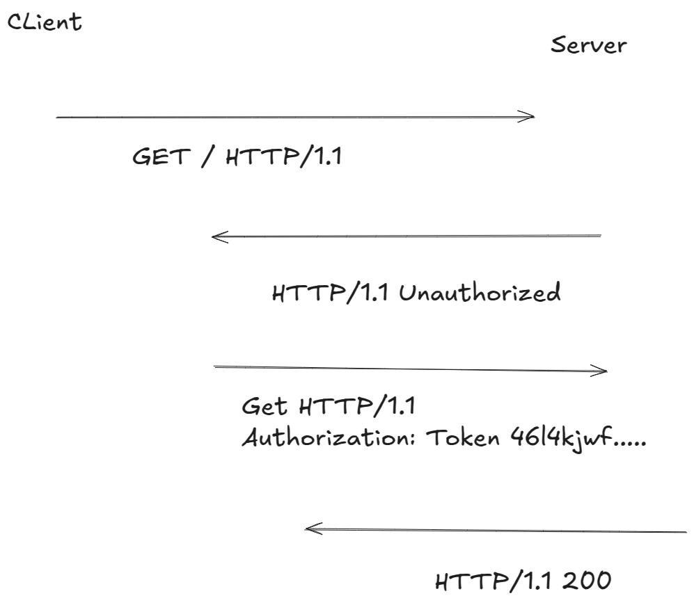
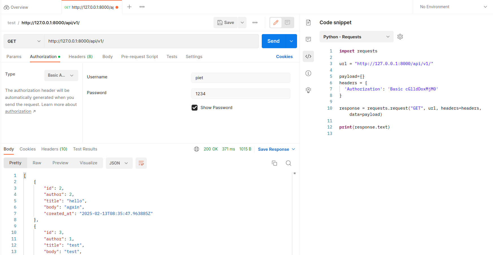
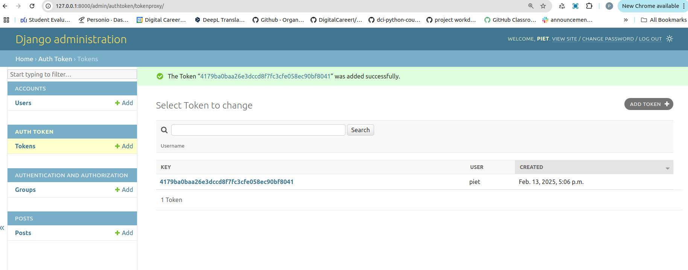
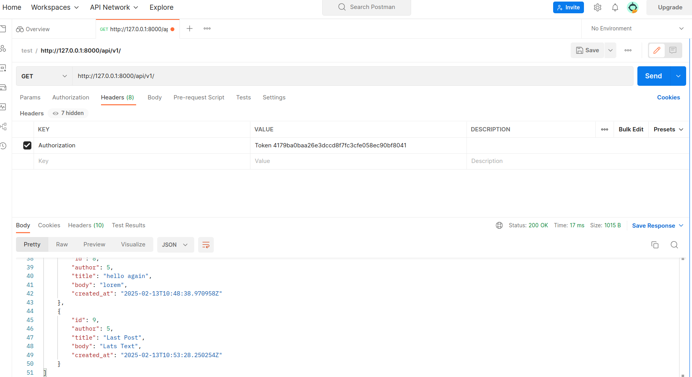

# Django API - Blog - 2: Authentication

> Learning Goals
>- understand and add authentication to our App
>- different Authentication methods
    >- Base Auth
    >- Token Auth
    >- Session Auth
>- use `dj-rest-auth`
>- Testing our App
>- ViewSet

**Last Session**

- restful django permission system
- levels of permission:
    1. project-level permissions: set in the `settings.py`
    2. view-level permissions
    3. object/model level permissions

- built-in permissions:
    1. AllowAny
    2. IsAuthenticated 
    3. IsAdminUser (the `is_staff` column of the user table has to be set to 1, to be recognized as an AdminUser)
    4. IsAuthenticatedOrReadOnly

How did we add the login/logout endpoints to our our django restful Api?
- we just had to add/include the `urls` from the `rest_framework`to our project-level urls.py

the urls.py from the rest_framework:
(taken from .venv/lib/rest_framework/urls.py)
```python
from django.contrib.auth import views
from django.urls import path

app_name = 'rest_framework'
urlpatterns = [
    path('login/', views.LoginView.as_view(template_name='rest_framework/login.html'), name='login'),
    path('logout/', views.LogoutView.as_view(), name='logout'),
]
```


How to set view-level permission?
- we can set the `permission_classes` class attribute in our restful DjangoViews

How to set model/object-level permission?
- We have to create a custom permission
- extending the BasePermission
    - we had to overwrite:
        1. has_permission
        2. has_object_permission


# User Authentication

- Previously we updated our APIs permissions, which is also called `authorization`. 

- we will implement `authentication` which is the 
process by which a user can register for a new account, log in with it, and log out.

Within a traditional, monolithic Django website authentication is simpler and involves a session-based cookie pattern 

But with an API things are a bit trickier. 

Remember that HTTP is a stateless protocol so there is no built-in way to remember if a user is authenticated from one request to the next. 

Each time a user requests a restricted resource it must verify itself.

The solution is to pass along a `unique identifier` with each HTTP request.

Confusingly, there is no universally agreed-upon approach for the form of this identifier
and it can take multiple forms.

Django REST Framework ships with different built-in authentication options:

1. basic,
2. session,
3. token

And there are many more third-party packages that offer additional features like JSON Web Tokens (JWTs).

## Basic Authentication

- The most common form of HTTP authentication is "Basic" Authentication. 
- When a client makes an HTTP request, it must send an approved  
  authentication credential before access is granted. 


- The complete request/response flow looks like this: 

1. Client makes an HTTP request
2. Server responds with an HTTP response containing a 401 or 403 status code 
3. Client sends credentials back via the `Authorization` HTTP header
4. Server checks credentials and responds with either 200 OK or 403 Forbidden status code.

Once approved, the client sends all future requests with the Authorization HTTP header credentials.

We can also visualize this exchange as follows:



Note that the authorization credentials sent are the unencrypted base64 encoded version of <username>:<password>. 

piet:1234
cGlldDoxMjM0

The primary advantage of this approach is its simplicity. 

But there are several major downsides.

- First, on every single request the server must look up and verify the username and password, which is inefficient.
- Second, user credentials are being passed in clear text—not encrypted at all—over the internet.

This is incredibly insecure.
Any internet traffic that is not
encrypted can easily be captured and reused.

Thus basic authentication should only be used via HTTPS, the secure version of HTTP.

#### Basic auth with postman

1. **Open Postman** and create a new request or open an existing one.
   
2. **Set the Request Type** to the desired HTTP method (e.g., `GET`, `POST`).

3. **Enter the URL** of your Django REST API endpoint.

4. **Set up Basic Authentication**:
    - In Postman, go to the **Authorization** tab.
    - Select **Basic Auth** from the dropdown.
    - Enter the **username** and **password** you want to use for authentication.

Postman will automatically **Base64 encode** your username and password as part of the request header (in the `Authorization` header), which looks like this:

```bash
   Authorization: Basic base64(username:password)
```

5. **Send the Request**:  
   Once the authorization is set, you can click **Send** and Postman will include the encoded credentials in the `Authorization` header of the request.





### Session Authentication

- Monolithic websites, like traditional Django, use an alternative authentication scheme  
  combining sessions and cookies. 

- The client authenticates with credentials (username/password) and receives a session ID.  
- The session ID is stored as a cookie and passed in the header of every future HTTP request.  
- The server uses the session ID to look up a session object containing user information. 
- This approach is stateful because the session object is maintained on the server  
    - and the session ID is stored on the client.

- The default setting in Django REST Framework combines  
  Basic Authentication and Session Authentication.

- The advantage of this approach is that it is more secure since user credentials  
  are only sent once, not on every request/response cycle as in Basic Authentication.  
- It is also more efficient since the server does not have to verify the user’s credentials  
  each time, just matching the session ID to the session object, which is a fast lookup. 

There are several downsides, however.

- First, a session ID is only valid within the browser where the login was performed;  
-  it will not work across multiple domains. 
- This is an obvious problem when an API needs to support multiple front-ends, 
such as a website and a mobile app.  
- Second, the session object must be kept up-to-date, which can be challenging in  
  large sites with multiple servers.  
- How do you maintain the accuracy of a session object across each server? 
- Third, the cookie is sent out for every single request, even those that don’t require authentication,  
  which is inefficient.  
- As a result, it is generally not advised to use a session-based authentication scheme  
  for any API that will have multiple front-ends.

### Token Authentication

- The third major approach—and the one we will implement in our Blog API—is to use token authentication.  
- This is the most popular approach in recent years due to the rise of single-page applications.  
- Token-based authentication is stateless: 
    - Once a client sends the initial user credentials to the server, a unique token is generated and then stored by the client as either a cookie or in local storage. 
    - This token is then passed in the header of each incoming HTTP request, and the server uses it to verify that a user is authenticated.  
    - The server itself does not keep a record of the user, just whether a token is valid or not.


**Cookies vs localStorage**

- Cookies are used for reading server-side information. 
    - They are smaller (4KB) in size and automatically sent with each HTTP request.  
- LocalStorage is designed for client-side information.  
  - It is much larger (5120KB) and its contents are not sent by default with each HTTP request.  
- Tokens stored in both cookies and localStorage are vulnerable to XSS attacks. 
- The current best practice is to store tokens in a cookie with the `httpOnly` and `Secure` cookie flags.


##### Cookie Flags
**httpOnly**
`Purpose:` Prevents client-side scripts from accessing the cookie.

- By setting the httpOnly flag on a cookie, it becomes inaccessible to JavaScript through document.cookie. 
- This helps mitigate attacks such as Cross-Site Scripting (XSS), where malicious scripts could attempt to steal cookies containing sensitive information.

**Secure:**
`Purpose:` Ensures that cookies are only sent over HTTPS connections.

The Secure flag tells the browser to send the cookie only when making requests over a secure HTTPS connection.
This prevents the cookie from being sent over unencrypted HTTP requests, which could be intercepted by attackers (e.g., through Man-in-the-Middle (MITM) attacks).

```python
response.set_cookie(
    'my_cookie_name',
    'my_cookie_value',
    httponly=True,  # Cookie is not accessible via JavaScript
    secure=True,    # Cookie is only sent over HTTPS
)
```

- There are multiple benefits using tokens 
- Since tokens are stored on the client, scaling the servers to maintain up-to-date session objects is no longer an issue. 
- Tokens can be shared amongst multiple front-ends:
    - The same token can represent a user on the website and the same user on a mobile app.  
- The same session ID cannot be shared amongst different front-ends, which is a major limitation.

- A potential downside is that tokens can grow quite large.
- A token contains all user information, not just an ID as with a session ID/session object setup. 
- Since the token is sent on every request, managing its size can become a performance issue.  

- Django REST Framework's built-in `TokenAuthentication` is deliberately quite basic. 
- As a result, it does not support setting tokens to expire, which is a security improvement that can be added. 
- It also only generates one token per user, so a user on a website and later on a mobile app will use the same token.

- **JSON Web Tokens (JWTs)** are a newer form of token containing cryptographically signed JSON data.
  - JWTs were originally designed for use in OAuth, an open standard way for websites to share access to user information without actually sharing user passwords.  
- JWTs can be generated on the server with a third-party package like `djangorestframework-simplejwt` 
- There is an ongoing debate, however, among developers on the pros and cons of using JWTs for user authentication.  
- we will stick to the built-in `TokenAuthentication`.
- we will use a simpler token based authentication approach

### Default Authentication

The `DEFAULT_AUTHENTICATION_CLASSES `are set by default so let’s *explicitly* add both `SessionAuthentication` and `BasicAuthentication` to our django_project/settings.py file.

```python
# django_project/settings.py
REST_FRAMEWORK = {
    "DEFAULT_PERMISSION_CLASSES": [
        "rest_framework.permissions.IsAuthenticated”,
    ],
    "DEFAULT_AUTHENTICATION_CLASSES": [ # new
        "rest_framework.authentication.SessionAuthentication",
        "rest_framework.authentication.BasicAuthentication",
    ],
}
```

Why use both methods?

The answer is they serve different purposes. 
Sessions are used to power the Browsable API and the ability to log in and log out of it.


### Implementing token authentication

Now we need to update our authentication system to use tokens. The first step is to update our DEFAULT_AUTHENTICATION_CLASSES setting to use
TokenAuthentication as follows:

Now we need to update our authentication system to use tokens. The first step is to update our DEFAULT_AUTHENTICATION_CLASSES setting to use
TokenAuthentication as follows:

```python
# django_project/settings.py
REST_FRAMEWORK = {
    "DEFAULT_PERMISSION_CLASSES": [
        "rest_framework.permissions.IsAuthenticated”,
        ],
    "DEFAULT_AUTHENTICATION_CLASSES": [
        "rest_framework.authentication.SessionAuthentication",
        "rest_framework.authentication.TokenAuthentication", # new
        ],
}
```

We keep SessionAuthentication since we still need it for our Browsable API, but now use tokens to pass authentication credentials back and forth in our
HTTP headers.

We also need to add the authtoken app which generates the tokens on the server. It comes included with Django REST Framework but must be added to our INSTALLED_APPS setting:

```python
# django_project/settings.py
INSTALLED_APPS = [
"django.contrib.admin",
"django.contrib.auth",
"django.contrib.contenttypes",
"django.contrib.sessions",
"django.contrib.messages",
"django.contrib.staticfiles", 
# 3rd-party apps
"rest_framework",
"rest_framework.authtoken", # new
# Local
"accounts",
"posts",
]
```

Since we have made changes to our INSTALLED_APPS we need to sync our database. Stop the server with Control+c. Then run the following command.

```shell
(.venv) > python manage.py migrate
(.venv) > python manage.py runserver
```
If you navigate to the Django admin at http://127.0.0.1:8000/admin/ you'll see there is now a Tokens section at the top.


- In Admin we could manually create Tokens




- these we could use for a TokenBased login



After all we have existing users.


To get the Token we would need an endpoint to GET the token (when logging in).

### Endpoints

We also need to create endpoints so users can log in and log out. We could create a dedicated users app for this purpose and then add our own urls, views, and
serializers. 

However user authentication is an area where we really do not want to make a mistake. 

And since almost all APIs require this functionality, it makes sense that there are several excellent and tested third-party packages we can use instead.

Notably we will use **dj-rest-auth**

We use them and don't need to reinventing the wheel.

### dj-rest-auth

First we will add log in, log out, and password reset API endpoints. 

These come out-of-the-box with the popular dj-rest-auth package. 

```Shell
(.venv) > pip install dj-rest-auth
```
Add the new app to the INSTALLED_APPS config in our django_project/settings.py file.

```python
# django_project/settings.py
INSTALLED_APPS = [
"django.contrib.admin",
"django.contrib.auth",
"django.contrib.contenttypes",
"django.contrib.sessions",
"django.contrib.messages",
"django.contrib.staticfiles", 
# 3rd-party apps
"rest_framework",
"rest_framework.authtoken",
"dj_rest_auth", # new
# Local
"accounts.apps.AccountsConfig",
"posts.apps.PostsConfig",
]
```
Update our django_project/urls.py file with the dj_rest_auth package. 

We're setting the URL routes to api/v1/dj-rest-auth. 

Make sure to note that URLs should have a dash - not an underscore _, which is an easy mistake to make.

```python
# django_project/urls.py
from django.contrib import admin
from django.urls import path, include

urlpatterns = [
    path("admin/", admin.site.urls),
    path("api/vi/", include("posts.urls")),
    path("api-auth/", include("rest_framework.urls")),
    path("api/v1/dj-rest-auth/", include("dj_rest_auth.urls"))

]
```
And we’re done!

We have a working log in endpoint at http://127.0.0.1:8000/api/v1/dj-rest-auth/login/.

And a logout endpoint at http://127.0.0.1:8000/api/v1/dj-rest-auth/logout/.

to use it in postmen: use `Authorization: Token {{token}}`


http://127.0.0.1:8000/api/v1/dj-rest-auth/password/reset

http://127.0.0.1:8000/api/v1/dj-rest-auth/password/reset/confirm