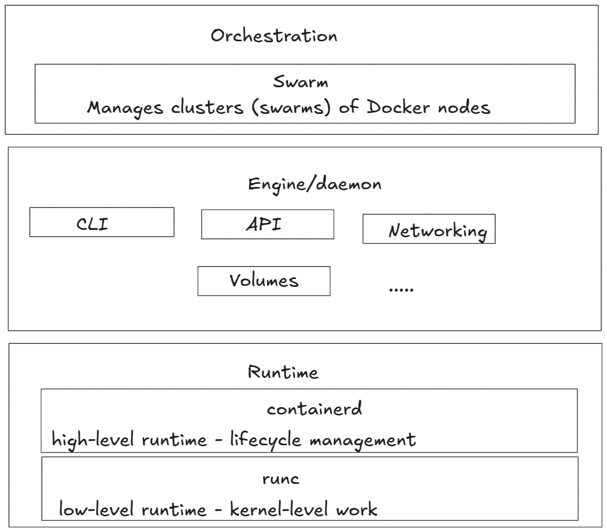

# CLOUD - DOCKER - 01: Intro

## The Bad Old Days: The challenge of server setup

*The Problem:**

* **One application per server:** Traditional approaches required a dedicated server for each application.
* **Oversized servers:** IT often purchased larger, more expensive servers to accommodate potential future needs.
* **Wasted resources:** Servers frequently operated at low capacity, leading to inefficient use of resources. 

**The Solution: VMware Virtual Machines**

* **Multiple applications per server:** VMs allowed for the consolidation of multiple applications onto a single physical server.
* **Improved resource utilization:** By sharing resources, VMs significantly increased server efficiency.
* **Reduced hardware costs:** Fewer physical servers were needed, leading to cost savings.

## Limitations of Virtual Machines

* **Overhead:** Each VM requires its own operating system, which consumes system resources.
* **Management complexity:** Managing multiple VMs can be more complex than managing physical servers.
* **Boot time:** VMs can be slower to start compared to physical servers.
* **Portability:** Moving VMs between different environments can be challenging.


## The Rise of Containers

**Key Advantages of Containers:**

* **Shared host OS:** Containers share the host operating system, reducing resource overhead.
* **Lightweight:** Containers are smaller and more lightweight than VMs.
* **Fast startup:** Containers start up much faster than VMs.
* **Portability:** Containers are highly portable and can be easily moved between different environments.

**Windows vs. Linux Containers:**

* **Windows containers:** Require a Windows host operating system.
* **Linux containers:** Require a Linux host operating system.

**Docker:** Simplified container management and deployment.

## Docker 

- Docker is software that runs on Linux and Windows.
- It creates, manages, and can even orchestrate containers.
    - *Docker swarm* and *Kubernetes (K8s)* are orchestration tools

Docker, Inc. is the company that created the technology and continues to create technologies
and solutions that make it easier to get the code on your laptop running in the cloud.

## The Docker technology

- When most people talk about Docker, they're referring to the technology that runs containers.
- However, there are at least three things to be aware of when referring to Docker as a technology:

1. runtime
2. The daemon
3. The orchestrator



## 1. Docker Runtime**

* **Low-level runtime:**
    - plays a fundamental role in the actual execution of containers
    - Responsible for directly interacting with the host operating system to start, stop, and manage containers.
    - **runc:** The most commonly used low-level runtime.
    - It interacts directly with the Linux kernel
    - Users rarely interact with low-level runtimes directly.
    - They are typically used by higher-level tools. 

* **High-level runtime:**
    - Manages the overall container lifecycle, 
      - including pulling images, 
      - creating containers, and 
      - managing runc instances (=individual, running containers that runc has launched)

    - Docker has evolved its architecture to rely on **containerd** as its core container runtime
    - Most users interact with containers through Docker's command-line interface (CLI). 
        - Docker then handles the communication with **containerd** behind the scenes

## 2. Docker Daemon (dockerd):**

- dockerd is the persistent background process that manages Docker containers. 
- Provides a user-friendly interface for interacting with containers.
- Handles tasks like managing images, volumes, networks, and clusters.
- Acts as a bridge between the user and the underlying runtime components
- The Docker CLI sends commands to the dockerd daemon through the Docker API.

- dockerd then executes those commands, 
  - interacting with the underlying container runtime (like **containerd**) to perform the necessary actions.


**Docker Swarm:**

- A technology for managing clusters of Docker nodes.
- Simplifies the deployment and management of distributed applications.
- Provides features like service discovery, load balancing, and high availability.

## Installing Docker

To install Docker on Ubuntu, follow these steps:

**1. Update the package lists:**

```bash
sudo apt update
```

**2. Install required dependencies:**

```bash
sudo apt install apt-transport-https ca-certificates curl software-properties-common
```

**3. Add the Docker repository:**

```bash
curl -fsSL https://download.docker.com/linux/ubuntu/gpg | sudo apt-key add -
sudo add-apt-repository "deb [arch=amd64] https://download.docker.com/linux/ubuntu $(lsb_release -cs) stable"
```

**4. Update the package lists again:**

```bash
sudo apt update
```

**5. Install Docker CE (Community Edition):**

```bash
sudo apt install docker-ce docker-ce-cli containerd.io
```

**6. Verify the installation:**

```bash
sudo systemctl status docker
```

**7. Start Docker (if not running):**

```bash
sudo systemctl start docker
```

**8. Check the Docker version:**

```bash
docker --version
```

* To manage Docker as a non-root user, create a Docker group and add your user to it:

```bash
  sudo groupadd docker
  sudo usermod -aG docker $USER
```

**9. Run a simple container:**

```bash
docker run hello-world
```

#### Images

It’s useful to think of a Docker image as an object that contains an OS 
filesystem, an application, and all application dependencies. 
If you work  in operations, it’s like a virtual machine template. 
A virtual machine  template is essentially a stopped virtual machine. 

In the Docker world, 
an image is effectively a stopped container. 
As a developer, you can think of an image as a class.


Run the docker images command on your Docker host.


```bash
$ docker images

REPOSITORY TAG IMAGEID CREATED SIZE
```
If you are working from a freshly installed Docker host, or Play With
Docker, you'll have no images

Getting images onto your Docker host is called pulling.

Pull the **ubuntu:latest** image.

```bash
$ docker pull ubuntu:latest
```

Run the docker images command again to see the image you just pulled.

```bash
$ docker images
```

An image contains enough of an operating system (0S), as well as all the code and 
dependencies to run whatever application it’s designed for.

The ubuntu image that we’ve pulled has a stripped-down version of the Ubuntu Linux 
filesystem and a few of the common Ubuntu utilities. 

If you pull an application container, such as **nginx:latest**, you'll get an 
image with a minimal OS as well as the code to run the app (NGINX).

It's also worth noting that each image gets its own unique ID.
When referencing images, you can refer to them using either IDs or names.

If you're working with image ID's, it’s usually enough to type the first few 
characters of the ID — as long as it’s unique, Docker will know which 
image you mean. 
