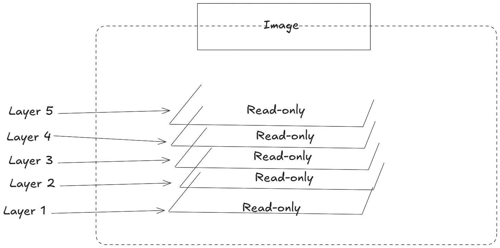
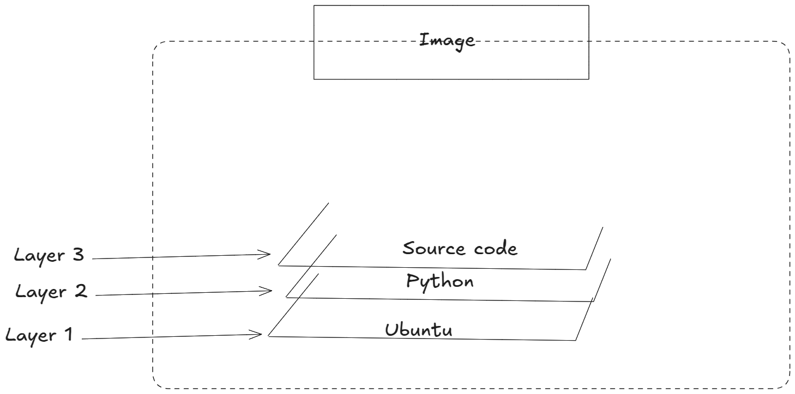

# CLOUD - DOCKER - 02: Images and Container

> Learning Goals
>- Difference between Images and Containers
>- Layers in Images
>- Containerize (Dockerize an App/Project)
>- Dockerfile

**Last Session**
- Deployment of Django on an ec2
    - we use bash script: 
        - Bash (Bourne-Again shell) is a specific type of shell
        - it's the most common shell on many Linux systems
        - **Bash script** is a specific type of shell script
        - *Shell script* is a general term
    - Advantage over manual deployment:
        - faster
        - more likely to deploy without error
    - Disadvantages:
        - script was generated for deployment on ec2 instances
            - therefore, it might fail on other server from different providers
    - to mitigate the this disadvantage we will in the near future deploy our app 
        in with the help of containers / docker
- intro of docker and its components:
    1. 1. **runc**: low-level runtime
    1. 2. **containerd**: high-level runtime
    2. **dockerd**: docker daemon (persistent background process)
    3. **Swarm**: orchestration tool for many docker containers

- the client talks to the daemon via a local **Unix socket**
- Images: object that contain the application code and everything necessary to run this application only:
    e.g.
    1. OS
    2. Dependencies

- list all images I have downloaded so far:
```bash
    docker images
```


###### Containers

Now that we have an image pulled locally we can use the docker run
command to launch a container from it.

```bash
docker run -it ubuntu:latest /bin/bash
```

Pressing Ctrl-PQ from inside a container will exit you from the container
***without killing it***.

You can see all running containers on your system using
the docker ps command.

```bash
$ docker ps
```

###### Attaching to running containers

```bash
$ docker exec -it hungry_solomon bash
```

The format of the docker exec command is:
docker exec <options> <container-name or container-id> <command/app>.
We referenced the container by
name and told it to run the bash shell. We could easily have referenced the
container by its hex ID.

Stop the container and kill it using the docker stop and docker
rm commands. Remember to substitute the names/IDs of your own
containers.

```bash
$ docker stop hungry_solomon
```

It may take a few seconds for the container to gracefully stop.

```bash
$ docker rm hungry_solomon
```

Verify that the container was successfully deleted by running the docker
ps command with the -a flag. Adding -a tells Docker to list all containers,
even those in the stopped state.
```bash
$ docker ps -a

CONTAINERID IMAGE COMMAND CREATED STATUS PORTS NAMES
```

- to remove all docker container:

```bash
docker rm $(docker ps -a -q)
```

### Containerized App Example

1. we'll clone an app from a Git repo, 
2. inspect its Dockerfile,
3. containerize it,
4. run it as a container. 

The Linux app can be cloned from: https://github.com/nigelpoulton/psweb.git 

```bash
$ git clone https://github.com/nigelpoulton/psweb.git 
$ cd psweb
```

- The app is a simple nodejs web app running some static HTML.
- The Dockerfile is a plain-text document that tells Docker how to build the app 
    - and dependencies into a Docker image.

```Dockerfile
FROM alpine

LABEL maintainer="nigelpoulton@hotmail.com"

RUN apk add --update nodejs nodejs-npm

COPY. /src

WORKDIR /src

RUN npm install

EXPOSE 8080 
ENTRYPOINT ["node", "./app.js"] 
```

- each line represents an instruction that Docker uses to build the app into an image. 
- the docker build command will create a new image using the instructions in the Dockerfile

```bash
$ docker build -t test2:latest . 
```

- This example creates a new Docker image called test2:latest. 
- Be sure to run the command from within the directory containing the app code and Dockerfile.

Once the build is complete, check to make sure that the new test2:latest
image exists on your host.

```bash
$ docker images

REPO TAG IMAGEID CREATED SIZE
test latest lede254e072b 7secondsago 154MB
```

- a newly-built Docker image with the app and dependencies inside was created

Run a container from the image and test the app.

```bash
$ docker run -d --name web1 --publish 8080:8080 test:latest
```

Open a web browser and navigate to the DNS name or IP address of the
Docker host that you are running the container from, and point it to port
8080. 

### Relationship between Images and Container


- Once a container is started from an image, they are dependent on each other.
- You cannot delete the image until all containers using it have been stopped and destroyed.

### Images Are Usually Small

- Containers run a single application or service, so images only include the necessary code and dependencies.
- Images are stripped of non-essential parts to remain small.
    - Example: The official Alpine Linux image is 7MB 
    - because it lacks unnecessary shells and package managers.
- Many images don’t include a shell or package manager unless required by the application.
- Images don’t include a kernel because containers share the host system's kernel.
- Images contain only essential OS components, like basic filesystem constructs.

### Pulling Images

- The local image repository on a Linux host is usually located in `/var/lib/docker/<storage-driver>`.

#### Image Registries
- Images are stored in centralized locations called **registries**.
- Registries securely store images and provide easy access across different environments.
- Common registries include **Docker Hub**, third-party registries, and secure on-premises registries.
- The Docker client defaults to **Docker Hub** unless specified otherwise.

#### Official Repositories

- **Docker Hub** has a concept of **official repositories** vetted by the application vendor and Docker, Inc.
- Official repositories contain up-to-date, secure, and well-documented images following best practices.
- **Unofficial repositories** may contain good images, but you must be cautious about their quality and security.
- Popular applications and operating systems often have official repositories on Docker Hub.
- These repositories are marked with a green "Docker official image" badge.

Examples of official repositories:
- **nginx**: [https://hub.docker.com/_/nginx/](https://hub.docker.com/_/nginx/)
- **redis**: [https://hub.docker.com/_/redis/](https://hub.docker.com/_/redis/)
- **mongo**: [https://hub.docker.com/_/mongo/](https://hub.docker.com/_/mongo/)

#### Image Naming and Tagging

- Images are addressed using the format `<repository>:<tag>`.
- If no tag is specified, Docker assumes you want the image tagged as `latest`.
- The `latest` tag does not guarantee the most recent image.

Examples of pulling images from official repositories:

```bash
$ docker pull alpine:latest
$ docker pull redis:latest
$ docker pull mongo:4.2.24
$ docker pull busybox:glibc
$ docker pull alpine
```

#### Pulling Images from Unofficial Repositories

- For unofficial repositories, prepend the repository name with the Docker Hub username or organization.

Example:
```bash
$ docker pull nigelpoulton/tu-demo:v2
```

##### Images and layers in detail
A Docker image is a collection of loosely-connected read-only layers where each layer comprises one or more files. 



- Each layer contains some part of the file system and dependencies needed for running an application.
- These layers are:
    - **Immutable (read-only)**: Once created, they cannot be changed. This helps ensure that the image remains consistent across all environments.
    - **Efficient storage**: Docker caches layers, so if different images share common layers, they only need to be stored and transferred once.

2. **Image**: The whole image is a collection of these layers, packaged together. It combines all the essential components needed to run an application.

This layered structure allows for reusability, as multiple images can share layers, reducing redundancy and improving efficiency in storage and distribution.

```bash
docker pull nigelpoulton/tu-demo:v2
v2: Pulling from nigelpoulton/tu-demo
38a8310d387e: Pull complete 
c5e459a2f580: Pull complete 
1bedd1d1e956: Pull complete 
bca16dc4b45b: Pull complete 
8e838417e4b5: Pull complete 
f061120d33a3: Pull complete 
c32386c9f636: Pull complete 
d78e0ef6ef0f: Pull complete 
Digest: sha256:95b7b0f23cb49d0aeaf37369969758cd13b4925eb87cfd31c8ee850cee5b70a5
Status: Downloaded newer image for nigelpoulton/tu-demo:v2
docker.io/nigelpoulton/tu-demo:v2
```

Each line in the output above that ends with “Pull complete” represents a layer in the image the was pulled.
- here we can see that we have 8 layers:


in a dockerized django image:

we could have 3 layers:



1. **Layer 1 - Ubuntu (Base)**:
2. **Layer 2 - Python**: 
    - This layer adds **Python** on top of the base Ubuntu image. It includes the Python runtime and libraries needed for running Python applications.
    - This layer builds upon the base OS layer, adding only the necessary components related to Python, making the image efficient.
3. **Layer 3 - Source Code**:
    - This layer contains the actual **application source code**.
    - It is the custom code for the application you are building or running in this container.
    - This layer is often unique for each application and changes frequently as the application code evolves.

##### Deleting Images

- **Command Overview**: The `docker rmi` command is used to delete images from your Docker host.
- **Multiple Image Deletion**: You can delete multiple images at once by listing them with whitespace between their IDs. For example:
  ```bash
  $ docker rmi f70734b6a266 a4d3716dbb72
  ```

  - **Images in Use**: You cannot delete an image if it is being used by a running container. You'll need to stop and remove the container first.

- **Deleting All Images**: A shortcut for deleting all images on a Docker host is to use the `docker rmi` command with the `-q` flag to list all image IDs:
  ```bash
  $ docker rmi $(docker images -q) -f
  ```
