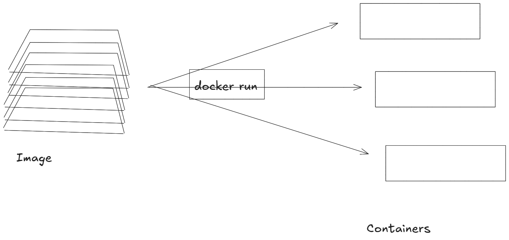
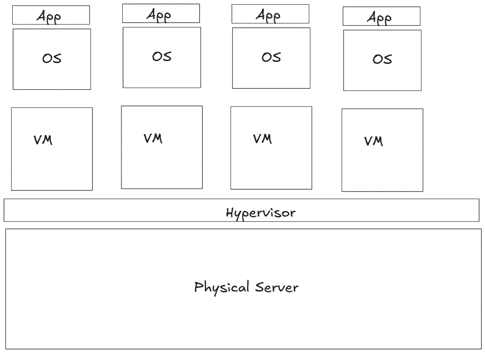
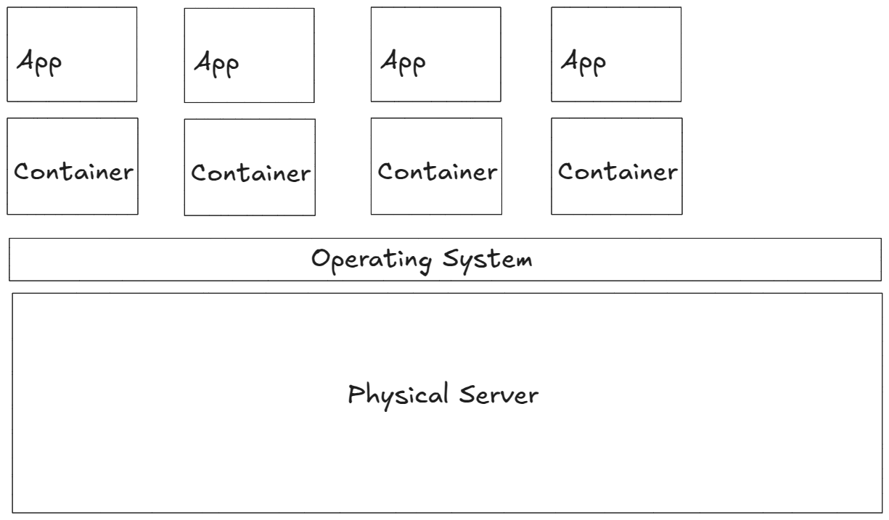

# CLOUD - DOCKER - 03: Containers in Detail

> Learning Goals
>- Compare with VM
>- Life Cycle of Containers
>- Data and Containers
>- Self healing containers and Restart-Policies
>- Push and Pull form Docker Hub

**Last Session**
- Difference between Images and Containers
    - Images are like templates for Containers
    - Images can contain OS
        - and application code
        - and its dependencies

    - I cannot change images, because
        - its layers are immutable / unchangeable / read-only
    - if we need to add instruction to an already existing image
        - an new layer is added and therefore a new image is created
    - layer can be reused for caching and that makes creating images more efficient
    - since layer can be reused across different images storing images become more efficient
        - e.g. 2 image can share the same base layer (e.g. OS layer)
    
- docker pull image_name:
    downloads all necessary layers for that image
- we pull by default from docker hub --> Image Registry
    - docker hub contains image repositories
        - we have two types of repos:
            1. official repos: 
                - I can trust the maintainers 
                - bested practice is here used
                - widely used images: battle-proved
            e.g. 
                - nginx
                - mongodb
                - postgres
                - mysql
                - alpine: minimal linux OS with just 7 MB 
            e.g. `docker pull alpine:latest`
            2. unofficial repos:
                - quality and security might not follow best practice
                    - and the image might be even unsecure

                e.g `docker pull nigelpoulton/tu-demo:v2`

- image commands:
    - build: `docker build -t test:v1 .`
        - with the `.` I'm telling docker were to look for the Dockerfile
            - the Dockerfile contains the instruction for creating the image
    - list all images on the computer:
        `docker images`
    - delete images:
        `docker rmi image-id(s) or image name(s) ` 

## Containers

The following figure visually represents how Docker containers are created from an image 
using the `docker run` command.


##### Running and Managing Docker Containers

- **docker run**: The simplest way to start a container. The basic format is:
  ```bash
  $ docker run <image_id or name> <app>
  ```

- **Example**: To start a new container using the Ubuntu image and launch a Bash shell:
  ```bash
  $ docker run -it ubuntu /bin/bash

What happens when the container's main application stops?

- **Container Lifecycle**: Containers run until their main application exits. 
- For example, in the previous command, the container will stop running once the Bash shell exits.

- **Running a Simple Command**: To see how containers work, you can run a command that exits after a short time. This command starts a container using the Alpine image and runs the `sleep` command for 10 seconds:


```bash
  $ docker run -it alpine:latest sleep 10
  ```

The container will seize the terminal for 10 seconds and then exit.

- **Managing Containers**:
  - **Stop a Container**: You can manually stop a running container with:
    ```bash
    $ docker stop <container-id>
    ```
  - **Restart a Container**: Restart a stopped container with:
    ```bash
    $ docker start <container-id>
    ```
  - **Remove a Container**: To permanently delete a container, use:
    ```bash
    $ docker rm <container-id>
    ```


### Containers vs VMs

Both containers and VMs require a host to run on, which could be a laptop, a bare-metal server, or a cloud instance.

#### VM Model:

- **Hypervisor**: A hypervisor is software that runs on the physical server and manages the virtual machines (VMs).
-  It claims all the physical resources (CPU, RAM, storage, network cards) and carves them into virtual constructs that mimic real hardware.
- **Operating Systems in VMs**: Each VM gets its own operating system (OS) installed, and applications run on top of that OS. 
 **Example**: If a business server needs to run 4 applications, the hypervisor would create 4 VMs, and each VM would have its own OS and application installed.



#### Container Model:
- **Container Engine**: In the container model, the host OS boots up and claims the physical hardware resources.
    - A container engine like Docker is installed, which carves up the OS resources (process tree, filesystem, network stack, etc.) into virtual environments called containers.
- **Applications in Containers**: Each container runs a single application.
    - The containers share the same host OS kernel, but each has its own isolated environment
    - This shared-kernel approach makes containers lightweight and efficient compared to VMs
- **Example**: In the same scenario of needing to run 4 applications, the OS would be carved into 4 containers, and each container would run a single application:



- **Key Difference:**
    - Hypervisors virtualize hardware, creating virtual machines (VMs) that run separate operating systems.
    - Containers virtualize the operating system, sharing the host OS kernel but maintaining isolated environments for each application

At a high level:
- **VMs** perform **hardware virtualization**.
- **Containers** perform **OS virtualization**.

#### The VM Tax

- **VM Overhead**: 
    - Each VM in the VM model is a separate software construct containing its own virtual CPUs, RAM, and storage.
    - **Each VM needs its own operating system (OS)**
    - **OS Overhead**: Every OS consumes valuable system resources
    - *Licensing and Maintenance**: Each OS may require its own licenses and must be maintained (e.g., patched, updated), increasing operational complexity.

#### Container Model Advantage:
- In the container model, there’s only **one shared OS kernel** running on the host. Containers share this kernel, which reduces overhead.
- **Single OS**: Only one OS consumes CPU, RAM, and storage, and it needs to be licensed, updated, and patched.
- **Resource Efficiency**: A single OS allows for **hundreds of containers** to run on the same host with minimal overhead, maximizing the system's efficiency and resources for the applications.

#### Exiting the Container
- 2 options:
    1. exit: terminates the bash process and therefore stops th container
    2. `Ctrl-PQ`: leaves the container running in the background, returning you to the Docker host shell.

#### Checking Running Containers
You can view the list of running containers with:

```bash
$ docker ps
CNTNRID IMAGE COMMAND CREATED STATUS NAMES  
e37..7e0a ubuntu:latest /bin/bash 6 mins Up 6mins sick_montalcini
```

#### Re-Attaching to a Running Container
To re-attach to a running container, use the `docker exec` command:

```bash
$ docker exec -it e37f24dc7e0a bash
root@e37f24dc7e0a:/#
```

- Running `ps -elf` now will show two Bash processes: the original one and the new one created by `docker exec`. 
- Exiting this new shell won’t terminate the container, as the original Bash process will continue running.

#### Stopping and Deleting the Container
If you're done with the container, you can stop and delete it with the following commands (substitute your container ID):

```bash
$ docker stop e37f24dc7e0a
e37f24dc7e0a

$ docker rm e37f24dc7e0a
e37f24dc7e0a
```

It may take a few seconds for the container to stop gracefully.


### Container Lifecycle

- we explore the full lifecycle of a container — from creation, operation, and stopping to its eventual deletion.
1. create container
2. store a file
3. stop container
What will happen to the file? - It will remain in this container
4. Reconnect to your container
5. delete container
What will happen to the file? It is deleted with the container.

#### Starting a Container
You can create and start a container using the `docker run` command. Here, we start a container named “percy” based on the Ubuntu image:

```bash
$ docker run --name bob -it ubuntu:latest /bin/bash
root@9cb2d2fd1de65:/#
```

#### Writing Data to the Container
Once inside the container, you can perform tasks. For example, writing text to a file in the `/tmp` directory:

```bash
root@9cb2d2fd1d65:/# cd /tmp
root@9cb2d2fd1d65:/# echo "Hello world" > newFile.txt
```

#### Stopping the Container
You can stop the container, putting it in a "vacation" state:

```bash
$ docker stop bob
percy
```

Running `docker ps` will not show the stopped container, but you can list all containers, including stopped ones, with:

```bash
$ docker ps -a
CONTAINERID IMAGE COMMAND CREATED STATUS NAMES
9cb...65 ubuntu:latest /bin/bash 4 mins Exited (0) bob
```

#### Restarting the Container
To bring the stopped container back, use `docker start`:

```bash
$ docker start percy

```

You can then reconnect to the container using `docker exec` and verify that the file you created still exists:

```bash
$ docker exec -it percy bash
root@9cb2d2fd1d65:/# cd /tmp
root@9cb2d2fd1d65:/# cat newFile.txt
Hello world
```

#### Persistent Nature of Containers
This example shows that stopping a container does not destroy its data. However, note:
1. Data stored inside the container is on the Docker host’s local filesystem. If the host fails, the data is lost.
2. Containers are meant to be immutable, and it's not recommended to write data directly to them. Instead, use **Docker volumes** for persistent storage outside the container.

#### Deleting the Container
To remove the container, you first stop it and then delete it:

```bash
$ docker stop percy
percy
$ docker rm percy
percy
```

#### Stop vs. Kill
Stopping the container gracefully allows the application running inside to shut down properly before deletion, reducing the **risk of data corruption**.

#### Self-Healing Containers with Restart Policies

unning containers with a **restart policy** is a basic form of self-healing that allows Docker to automatically restart failed containers. Restart policies can be set on the command line or through YAML files for tools like Docker Swarm, Docker Compose, and Kubernetes.


Here are the three common restart policies:
- **always**
- **unless-stopped**
- **on-failure**

#### Example: `--restart always` Policy

- The `always` policy restarts a container whenever it fails, unless it has been explicitly stopped.

```bash
$ docker run --name neversaydie -it --restart always alpine sh
/# 
```

#### Example: `--restart always` Policy
The `always` policy restarts a container whenever it fails, unless it has been explicitly stopped. For example, running this command will start an Alpine container with the `--restart always` policy:

```bash
$ docker run --name neversaydie -it --restart always alpine sh
/# 
```

After typing `exit` to kill the container’s process, Docker will automatically restart it. You can verify this by checking the container’s status:

```bash
$ docker ps
CONTAINERID IMAGE COMMAND CREATED STATUS NAME 
0901afb84439 alpine "sh" 35 seconds ago Up 9 seconds neversaydie
```

Notice how the container was created 35 seconds ago but has only been running for 9 seconds. This confirms that Docker restarted the same container.

#### Difference Between `--restart always` and `--restart unless-stopped`

- **`always`**: Restarts the container even after the Docker daemon is restarted, regardless of its previous state.
- **`unless-stopped`**: Restarts the container only if it was running before the Docker daemon was restarted. If the container was stopped, it won’t be restarted.

#### `on-failure` Policy

- The `on-failure` policy restarts a container only if it exits with a non-zero exit code.
- Like the `always` policy, it will restart containers after a Docker daemon restart, even if they were previously stopped.

 using restart policies helps make containers self-healing, 
  - ensuring minimal downtime in case of failures. 
- These policies are particularly useful for ensuring application availability in production environments.

