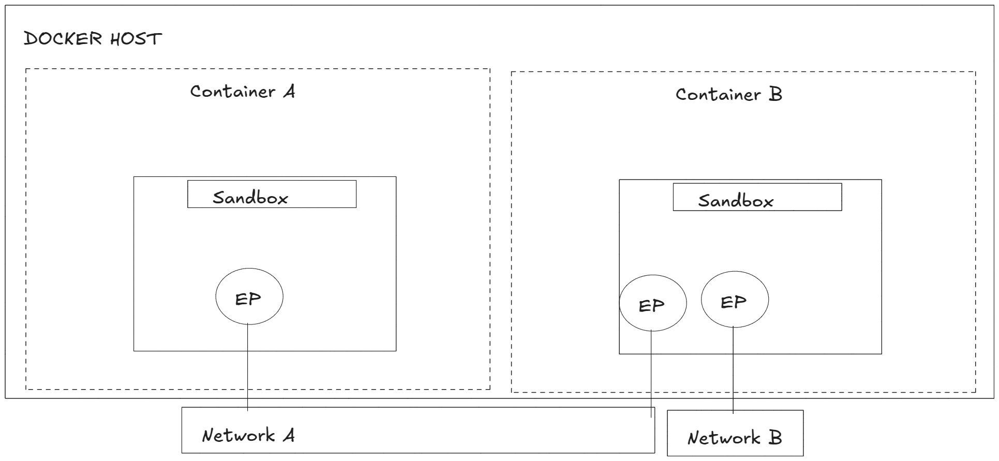

# Cloud - Docker - 05: Networks

> Learning Goals
>- Docker's Networking Solution
>- Container Network Model (CNM)
>- Network types & Drivers
>- understand how to connect two container with one network

**Last Session**

- We dockerized our Django project and for that we added
    - docker-compose.yml
    - Dockerfile
    - for nginx config:
        - default.conf

1. Dockerfile:
    - contains Instructions how to build a new Image that is built on top of another Base Image
        - e.g. python:3.9-slim
        - the other Instructions add Dependencies and the project's source code
        - it also exposes the container on a specific port 
        - and defines the main command

2. docker-compose.yml
    - first we define services
        - each service will represent a container
    - we create volumes for the static files
        - from the web container we save the statice files to the `static_volume_live:` volume
        - we do that so that the nginx container has access to the static files stored in `static_volume_live:`
        - we also stored the default.conf in this volume to make accessable to the `nginx` container
    - we also created a network: `app-network_live:` to connect the `nginx` and `web` container

3. default.conf
```bash 
location /static/ {
        alias /usr/src/app/staticfiles/;
    }
```

- tell nginx where to look for the static files

```bash 
location / {
        proxy_pass http://web:8000; 
        .....
```

- tells nginx to what endpoint Http requests should be forwarded
- `http://web:8000` web represents the DNS for my web container
    - this container listens on port 8000 (that is defined in the Dockerfile)

### Docker Networking Overview

- Docker runs applications inside containers,
    - which need to communicate with other applications (both inside and outside containers).
- Strong networking capabilities are required to facilitate this communication.

- **Docker's Networking Solutions:**
    - Supports **container-to-container networks**.
    - Can connect to **existing networks** 
        - enabling interaction with external services (VMs, physical servers)

- Docker networking is based on the **Container Network Model (CNM)**.

- **Built-in Network Drivers:**
    - Docker includes **native drivers** for common networking needs:
    - **Single-host bridge networks**: allows containers on the same host to communicate
     - **Multi-host overlays**: allows containers to communicate across multiple hosts

A VLAN (Virtual Local Area Network) is a logical subdivision of a network that groups devices together, even if they are on separate physical networks.

## Theory

Docker networking consists of **three major components**:

1. **Container Network Model (CNM)** 
    - The **design specification** for Docker networking. 
    - Defines the **fundamental building blocks** of a Docker network.  

2. **Libnetwork** 
    - The **implementation** of CNM. 
    - Provides **networking APIs** and manages network operations in Docker.  

3. **Drivers** 
    - Enable **different network types** (e.g., bridge, overlay)
    - Allow **pluggable networking** so users can extend functionality.

### Container Network Model (CNM)

#### **Three Key Building Blocks of CNM**  

1. **Sandboxes** 
    - An **isolated network stack** in a container / provides an isolated network environment 
    - Includes **Ethernet interfaces, ports, routing tables, and DNS configurations**.  

2. **Endpoints**
    - **Virtual network interfaces**
    - Responsible for connecting **sandboxes to networks**

3. **Networks** 
    - A **software implementation of a switch**.
        - (networking device that connects multiple devices within a local network). 
    - Groups and isolates a collection of **endpoints** that need to communicate.


- Container A has a single interface (endpoint) and is connected to Network A. 
- Container B has two interfaces (endpoints) and is connected to Network A and Network B. 

- The two containers can communicate because they are both connected to Network A. 

- However, the two endpoints in Container B cannot communicate with each other 
- endpoints can only be connected to a single network. 

- Therefore, a container needing to connect to multiple networks will need multiple endpoints.

- Although Container A and Container B are running on the same (DOCKER) host, 
    - their network stacks are completely isolated at the OS-level via the sandboxes and can only communicate via a network:
    


#### Libnetwork

-  all Docker networking logic is handled by `Libnetwork`
    - Initially, Docker’s networking code was inside the daemon
        - bloated
        - not modular
        - difficult to modify

- Implements core CNM components (sandbox, endpoint, network).
- Provides ingress-based container load balancing.
    - Incoming requests are distributed across multiple containers running the same service.

#### Drivers

- they control how containers connect and communicate.
- They implement network connectivity for containers
- They are responsible for the creation of networks in Docker


1. **Types of Built-in Docker Network Drivers**  

    -  **Bridge** (single-host networking)
    - **Overlay** (multi-host networking) 

    - **Third-party drivers** can be created for **custom network topologies**.

2. **How Network Drivers Work** 
    - Every **network is owned by a driver**.
    - The driver is responsible for **creating, managing, and deleting network resources**.  

3. **Multi-Driver Support in Docker**  
    - Docker **supports multiple network drivers running at the same time**.  
    - This allows for **complex and hybrid network setups** (e.g., some containers using bridge networks, others using overlay networks).


- Docker networking is **modular** and allows containers to communicate via different **network drivers**

##### Single-host bridge networks

The simplest type of Docker network is the single-host bridge network.

- Single-host tells us it only spans a single Docker host and can only connect containers that are on the same host. 


- Even though the networks are identical, 
    they are independent and isolated.
- This means the containers in the picture cannot communicate 
    - because they are on different networks.

- Every Docker host gets a default single-host bridge network. 
- On Linux it’s called “bridge” 

- By default, all new containers will be attached to these networks 
    - unless you override it on the command line with the `—network` flag.

#### **1. Default Docker Network on Linux**

- Command:  
```bash
  docker network ls
  ```
- Output:
```bash
NETWORK ID     NAME      DRIVER    SCOPE
30d347436da1   bridge    bridge    local
e8f33401155b   host      host      local
a1b31c6e47eb   none      null      local
```
30d347436da1   bridge   is the default network
- It uses the **bridge** network driver.
- The default network is named **bridge**.
- **Scope** is **local**, meaning it exists only on this Docker host.

- Docker networks built with the bridge driver on Linux hosts are based on linux bridge technology
- that has existed in the Linux kernel for 20 years.
- This means they're high performance and extremely stable. 
- It also means you can inspect them using standard Linux utilities. 


- The default **“bridge”** network, on all Linux-based Docker hosts, 
    - maps to an underlying Linux bridge in the kernel called “**docker0**”.
- We can see this from the output of docker inspect.


shows containers connecting to the “bridge” network. The “bridge” network maps to the “docker0” Linux bridge in the host's kernel, which maps to an
Ethernet interface on the host via port mappings.


**Linux Kernel Bridge ("docker0")**

- A **virtual Ethernet switch** created by Docker in the **Linux kernel**. 
- It connects **Docker containers to each other** and **handles internal communication**.

**Physical Network Interface (ethX) and HW (Hardware Layer)** 
- Represents the **physical network interface** (e.g., `eth0`, `wlan0`), which connects the host machine to an external network.

#### **1. Creating a New Bridge Network in Docker**

The command:  
```bash
docker network create -d bridge localnet
```
- Creates a **new single-host bridge network** named `localnet`.
- This network will now appear in `docker network ls`.


```bash
brctl show

bridge name     bridge id               STP enabled     interfaces
br-5d94cd17be8f 8000.be1c88a3ba63       no
docker0         8000.8e875777304a       no
```

#### **1. Running a Container on `localnet`**

The command:  
```bash
docker run -d --name c1 --network localnet alpine sleep 1d
```

- **`-d`** → Runs the container in **detached mode** (in the background).
- **`--name c1`** → Assigns the container a **name** (`c1`).
- **`--network localnet`** → Connects the container to the **custom `localnet` bridge**.
- **`alpine sleep 1d`** → Runs a lightweight **Alpine Linux container** that sleeps for **1 day**, keeping it alive.


#### **2. Verifying Network Attachment**

After running the container, check if it is attached to `localnet` using:  
```bash
docker inspect c1
```

- This will display **network details**, including:
  - **Assigned IP address**
  - **Connected network (`localnet`)**
  - **Gateway & Subnet details**


- If we add another new container to the same network, it will be able to ping the “c1” container
- This is because all containers automatically register with the embedded Docker DNS service
    -  allowing them to resolve the names of all other containers on the same network


#### **1. Creating a Second Container (`c2`) on the Same Network**
Command:  
```bash
docker run -it --name c2 \
  --network localnet \
  alpine sh
```
- **`-it`** → Runs the container in **interactive mode** with a shell (`sh`).  
- **`--name c2`** → Names the container `c2`.  
- **`--network localnet`** → Connects `c2` to the same **`localnet`** bridge network.  
- **`alpine sh`** → Runs an interactive **Alpine Linux shell**.  
- Once executed, the **terminal switches inside `c2`**, allowing commands to be run inside it.


#### **2. Testing Network Connectivity Between Containers (`c1` ↔ `c2`)**
Inside the `c2` container, run:  
```bash
ping c1
```
Output:
```
Pinging c1 [172.26.137.130] with 32 bytes of data:
Reply from 172.26.137.130: bytes=32 time=1ms TTL=128
Reply from 172.26.137.130: bytes=32 time=1ms TTL=128
Control-C
```
- **Ping succeeds**, confirming `c2` can communicate with `c1` by **name** (`c1`).
- Docker **automatically resolves container names** using an internal **DNS resolver**.
- This happens because:
  - Docker's internal **DNS server** maintains mappings for containers started with `--name` or `--net-alias`.


- So far, we've said that containers on bridge networks can only communicate with other containers on the same network.

- However, you can get around this using port mappings.

- Port mappings let you map a container to a port on the Docker host. 
- Any traffic hitting the **Docker host** on the configured port will be re-directed to the container.

#### Example: Running an NGINX Container with Port Mapping**

Command:  
```bash
docker run -d --name web \
  --network localnet \
  --publish 5001:80 \
  nginx
```
**Breakdown:**
- **`-d`** → Runs in **detached mode** (background).
- **`--name web`** → Names the container `web`.
- **`--network localnet`** → Connects the container to **`localnet`**.
- **`--publish 5001:80`** → Maps:
  - **Container port 80 (NGINX default)** → to **host port 5001**.
- **`nginx`** → Runs the **NGINX web server**.


### **2. Verifying the Port Mapping**
Command:
```bash
docker port web
```
Output:
```
80/tcp -> 0.0.0.0:5001
80/tcp -> [::]:5001
```
- **0.0.0.0:5001** → Means the container is **accessible on all host interfaces** via port **5001**.
- **[::]:5001** → IPv6 equivalent.

### **3. Accessing the Web Server**
After running the container, open a browser or use `curl` to test:
```bash
curl http://localhost:5001
```
- If successful, it will return **NGINX's default welcome page**.

