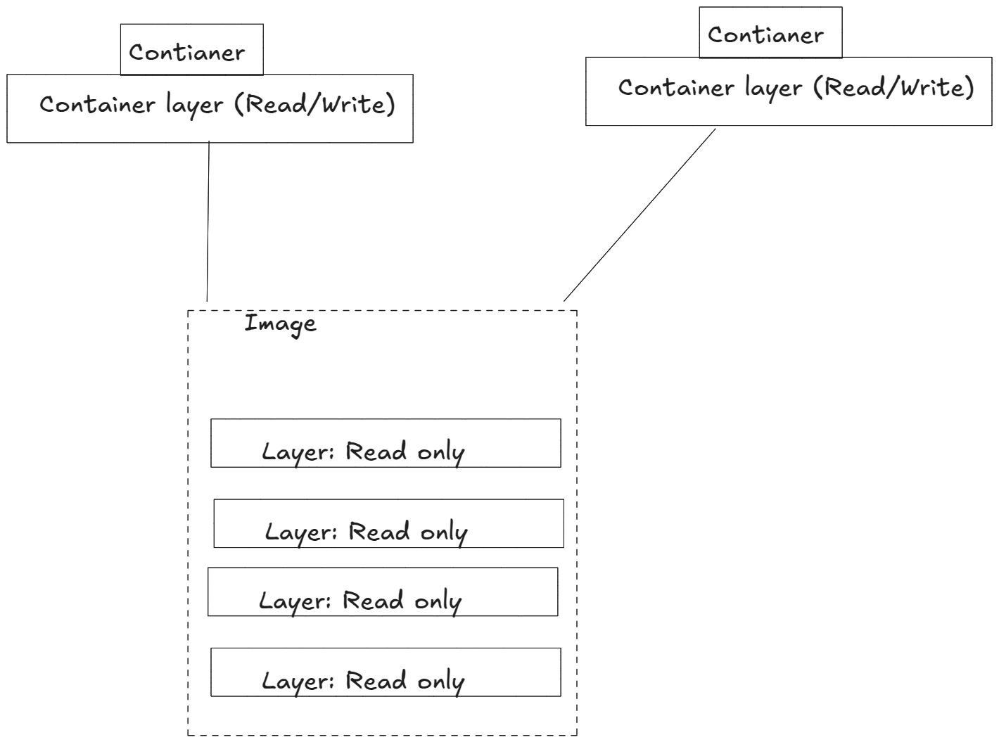
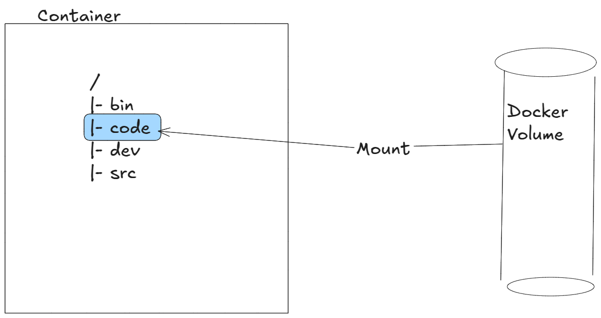

# Cloud - Docker - 06: Volumes

> Learning Goals
>- understand volumes
>- create Volumes
>- use cases for volumes
>- attach volumes to containers
>- Intro to CI(/CD)
>- Example of CI in Github (Action)

**Last Session**

- docker networking
    - via networks containers can communicat with each other
- network are based / created by `Network drivers`:
    1. `bridge`: single-host networks: only containers on the same docker host can communicate
    2. `overlays`: multi-host networks: containers can communicate across multiple hosts
- docker networks are based on the CNM: `Container Network Model`
- this model is implemented in `Libnetwork` 

- components of the CNM:
    1. sandbox: isolated environment/ isolated network stack
    2. Endpoints
    3. networks

- commands
    - create a network: `docker network create -d bridge mynet`
    - attach network to a container: `docker run -d --name myContainer --network mynet nginx`
    - attach another container to the same network: `docker run -d --name myContainer2 --network mynet alpine sleep 1d`
    - to get the information about dns name resolution or ip address we can write: `docker inspect myContainer2`
    - the ip address will be assigned only to running containers

## Volumes and persistent data

- Stateful applications that persist data are increasingly important in cloud-native and microservices environments.
- we will focus on how Docker manages applications that require persistent data storage.

## There are two main categories of data — persistent and non-persistent.

- **Persistent data** includes information that must be retained, such as: 
    - Customer records 
    - Financial data
    - Research results
    - Certain types of application log data 

- **Non-persistent data** is temporary and does not need to be retained. 
- **Docker handles both types of data** with different approaches:  

    - **Non-persistent storage**: 
        - Each Docker container gets its own temporary storage.
        - This storage is automatically created with the container.  
        - It is tightly linked to the container’s lifecycle.  
        - Deleting the container removes the storage and all data on it.

    - **Persistent storage (Volumes)**: 
        - Containers store persistent data in **volumes**. 
        - Volumes are independent objects, separate from containers.  
        - They can be created and managed separately. 
        - They **do not get deleted** when the container is removed.

### Volumes and persistent data

- Containers handle both **persistent and non-persistent data**, similar to virtual machines. 


**Containers and non-persistent data**

- **Containers are designed to be immutable**, meaning they are **read-only** by default.  
- **Best practice**: Avoid changing a container’s configuration after deployment. 
- **Handling changes**:
    - Instead of modifying a running container, create a **new container** with updates or fixes.  
    - Replace the old container with the updated version. 
    - **Never manually log into a running container** to make changes.

- **Challenge**: Some applications require a **read-write filesystem** to function.
- **Solution**:
    - Containers in Docker include a **thin read-write layer** on top of their **read-only image**.
    - This allows applications to write data while keeping the base image immutable.

 
shows two running containers sharing a single read-only image.

- Each **writable container layer** is stored on the **Docker host's filesystem**.  
- It is referred to by different names, including:
    - **Local storage**  
    - **Ephemeral storage**  
    - **Graphdriver storage**  

- The **thin writable layer** is essential for **read/write operations** in many containers.  
- Any updates or new files added by you or an application are written to this layer.
- **Lifecycle dependency**:  
  - This layer is **tightly coupled** to the container.  
  - It is **created when the container starts** and **deleted when the container stops**.
  - Since it gets deleted with the container, it is **not suitable for storing important data**.  

- **Solution for persistent data**:  
  - **Volumes** are the **recommended method** for data persistence in Docker containers.

- Volumes are independent objects that are not tied to the lifecycle of a container
- Volumes can be mapped to specialized external storage systems
- Volumes enable multiple containers on different Docker hosts to access and share the same data

1. **Create a volume**.
2. **Create a container** and **mount the volume** into it. 
3. The volume is **mounted to a directory** inside the container’s filesystem.  
4. Any data written to this directory is **stored in the volume**.  

- **Key benefit**:  
  - Even if the **container is deleted**, the **volume and its data remain intact**.

 
it shows a Docker volume existing outside of the container as a separate object. 

- A **volume exists outside the container** as an independent entity. 
- It is **mounted** into the container’s filesystem at /code
- Any data written to /code is **stored in the volume** and remains **even after the container is deleted**.  

- **Storage options for Docker volumes**:  
  - Can be mapped to an **external storage system** (e.g., **cloud storage, AWS EBS**).
  - Can be mapped to a **directory on the Docker host**.


- **Key advantage**:  
    - The **volume’s lifecycle is decoupled** from the container.
    - Other directories in the container still use the **thin writable layer** on the Docker host.

**Creating and managing Docker volumes**

- They have their own **API objects**.  
- They have a dedicated **Docker CLI sub-command** (`docker volume`).  

- **Creating a new volume**:  

    - Use the following command to create a volume named `myvol`:  

```bash
$ docker volume create myvol
myvol
```

- **Viewing created volumes**:  
  - List all Docker volumes:  
```sh
docker volume ls

DRIVER    VOLUME NAME
local     blog_api_static_volume_live
local     myvol
```

- **Default volume driver**: 
    - Docker **uses the built-in local driver** by default.
    - **Local driver volumes** are **limited to containers on the same node**.

- **Using a different driver**:  
    - Use the `-d` flag to specify a different volume driver:  
    ```sh
    docker volume create -d <driver_name> myvol
    ```

- **Third-party volume drivers**: 
    - Available as **plugins** to extend Docker's functionality.  
    - Enable seamless integration with **external storage systems**, such as:  
    - **Cloud storage services** (e.g., AWS, Google Cloud, Azure). 

 - **Inspecting a specific volume**:  
  - Get detailed information about a volume:  
```sh
    docker volume inspect myvol
```  
  - This command provides details such as the volume’s mount point, driver, and other metadata.

```bash
  [
    {
        "CreatedAt": "2025-03-13T11:04:34+01:00",
        "Driver": "local",
        "Labels": null,
        "Mountpoint": "/var/lib/docker/volumes/myvol/_data",
        "Name": "myvol",
        "Options": null,
        "Scope": "local"
    }
]
```

- **Driver: `local`** → The volume was created using the **local driver**.  
- **Scope: `local`** → The volume is only available on this **Docker host**. 
- **Mountpoint** → Shows the volume’s location in the Docker host’s filesystem.  

- **Storage location for local volumes**:  
  - On **Linux**:  
    ```sh
    /var/lib/docker/volumes
    ```

- **Direct access from the Docker host**:  
  - You **can** manually view and modify volume data from the host, but **this is not recommended**. 

- **Next step**:  
  - Now that the volume is created, it can be **mounted and used by one or more containers**.

**Demonstrating volumes with containers and services**

Use the following command to create a new standalone container that mounts a volume called 
`myvol`

```bash
$ docker run -it --name MyCont \
--mount source=myvol,target=/vol \
alpine
```

- The `--mount` flag is used to attach a **volume** to a container at a specific path. 
- if myvol **does not already exist**, Docker **automatically creates it** before running the container.


- If you specify an existing volume, Docker will use the existing volume

```bash
docker exec -it myCont sh
cd vol
echo "Hello World" > file.txt
```

next we will delte my Cont:

```bash
docker rm myCont
```

we created a new container:

```bash
$ docker run -it --name NewCont \
--mount source=myvol,target=/vol \
alpine

cd vol
cat file.tx
Hello world
```

To delete volumes

- docker volume rm

docker volume rm lets you specify
exactly which volumes you want to delete. 

As the myvol volume is not in use, delete it

```bash
docker volume rm myvol
```


