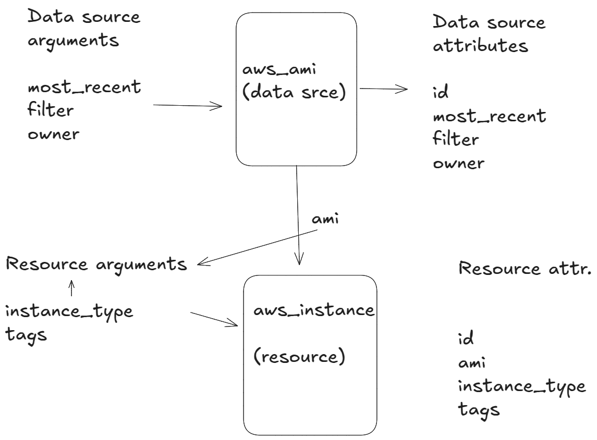
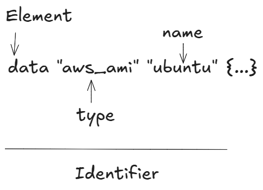

# Cloud - Infrastructure as Code - 02: Terraform

>Learning Goals
>- continue with Terraform
>- talk about other aws Service
>   - S3
>   - RDS

**Last Session**

- Terraform
    - automation
    - providing/provisioning infrastructure as a code
- e.g. we could create **resources**
    - ec2
    - vpc
    - rds
    - add a ec2 to a subnet can be public via igw
    - add a rds to a subnet can be private (stay private and only ec2 would have access
        to the rds)

- to generate the credential file for terraform to gain access
    - we first had to use `aws cli`
        - `aws configure`
            - here we set the AWS Access Key ID and the AWS Secret Access Key
            - to get those we have to go to the IAM
                1. click on your user
                2. generate your keys
    - aws terraform provider
```bash
provider "aws {
    region = "eu-central-1"
}
```
- side note:
    - eu-central-1 is an aws region
    - `eu-central-1a` or `eu-central-1b` is an availability zone in that region
- the command to download the aws provider specified in the main.tf file:
    `terraform init`
- `terraform apply`
    - deploys my defined resources
-  `terraform plan`
    - shows you what will be done without affecting aws

- we used `aws cli` to create & destroy ec2, show users
    - why do we need then terraform?
    - the aws cli commands are long and become unreadable
    - managing multiple resources becomes harder as your infrastructure grows


### Terraform continued

- **Do NOT manually delete or edit `terraform.tfstate`**
- If lost, Terraform **won’t track existing resources**, potentially causing duplicate creations or orphaned resources.  

- **`terraform destroy` is equivalent to deleting all `.tf` files and running `terraform apply`** 
- Ensures **all associated resources are properly cleaned up**.

  - **Why So Many Attributes?** 
    - The **original resource block** only defined `ami`, `instance_type`, and `tags`.
    - **Terraform retrieves additional attributes** (e.g., `id`, `public_ip`, `private_ip`, `state`). 
    - Many attributes are **optional** or **computed** dynamically by AWS.

### Example 2

- Terraform can do much more than simply provision resources from static configuration code.
- It's also able
to provision resources dynamically

- Let us now consider `data sources`,
    - are elements that allow you to fetch data at runtime
    - and perform computations

- e.g. 
    - look up the latest value of the Ubuntu AMI



The diagram illustrates the relationship between a data source (`aws_ami`) and a resource (`aws_instance`) in the context of Terraform

**Data Source (`aws_ami`)**:
- refers to an Amazon Machine Image (AMI) data source. 
- retrieves information about AMIs from AWS that meet the specified criteria.

**Data Source Attributes**:
- the data source outputs specific attributes based on the results, including:
     - `id`: The unique ID of the AMI.

**Resource (`aws_instance`)**:
    - This represents an AWS EC2 instance that will be created using the selected AMI.



- The contents of a data source code block are called query constraint arguments.
- The query constraint arguments are used to specify resource(s) from which to fetch data.
- Data sources are unmanaged resources that Terraform can read data from but that Terraform doesn’t directly control.
    