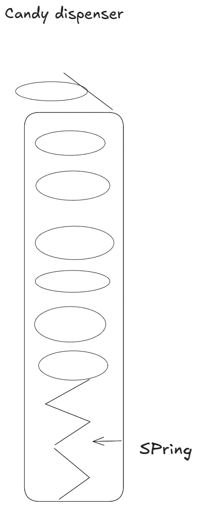

# Buffer day - Data Structure: Stacks (and Queues)

>Learning Goals
>- What are stacks
>- How to implement them
>- Use cases and examples
>- Stacks vs Queues
>- LIFO vs. FIFO

**Last Session**

- S3 - Simple Storage Service:
    - Objects can be stored
        - uploaded data is considered as objects
        - objects have attributes like permissions
        - and up load it in buckets (buckets have to be unique)
    - costs:
        1. GB per month
        2. amount of request
        3. type of requests
        4. region
    - Types of S3
        - Standard S3:
            - is used when you access it frequently
                - css, images, jss, html
                - used for hosting static web sites

- RDS - Relational Database Service
    - it is managed by AWS
        - this reduces our operational costs
        - automatic back ups
        - support multiple availability zones in one region
    - we can connect our ec2 to rds via vpc
        - best practice to keep rds in a private subnet
    - scalability
        - vertically
        - horizontally

## Data Structure: Stacks

- A stack follows the **last-in, first-out (LIFO)** principle. 
e.g. ['A', 'B', 'C'] here 'C' is last-in and would go first out
- Objects are inserted at any time but removed only from the **top**.  
- The name **“stack”** comes from a cafeteria plate dispenser. 
- **Push:** Adds an object to the top of the stack.  
- **Pop:** Removes the most recently inserted object from the top. 

- Stacks are a **fundamental data structure** used in many applications.

**Example 1**
Internet Web browsers store the addresses of recently visited sites
in a stack.
Each time a user visits a new site, that site’s address is “pushed” onto the
stack of addresses.
The browser then allows the user to “pop” back to previously
visited sites using the “back” button.

**Example 2**
Text editors usually provide an “undo” mechanism that cancels recent 
editing operations and reverts to former states of a document.
This undo operation can be accomplished by keeping text changes in a stack.


schematic drawing of an dispenser: physical implementation af a stack

### The Stack Abstract Data Type

- **Stacks** are the **simplest yet most important** data structures.
- Used in **many applications** and as a tool for **complex structures**.

- core methods:
    - **S.push(e):** Adds element `e` to the top of stack `S`.  
    - **S.pop():** Removes and returns the top element; errors if empty. 
    - **S.top()** just return last element, but does not change the stack
    - **S.is_empty():** Returns `True` if stack `S` has no elements. 
    - **len(S):** Returns the number of elements in stack `S`.  
- A **new stack** is **empty** by default.  
- Stacks have **no fixed capacity** and can store elements of **any type**.

```python
S.push(5) --> [5]
S.is_empty() --> False
S.push(3) --> [5, 3]
S.top() --> returns 3, but does not remove
len(S) --> returns 2
S.pop() --> [5] ;returns 3
S.pop() --> []; returns 5
S.pop() --> error
S.is_empty() --> True
```

- **Python lists naturally support stack operations:** 
    - `.append(e)` → **Push** (adds to the top)  
    - `.pop()` → **Pop** (removes from the top(last element))  
- **Stack's top is stored in the rightmost position of the list.**  
- **Using a list directly as a stack is possible, but:**
    - Lists allow inserting/removing **anywhere**, breaking the **stack abstraction**.  
    - **Terminology mismatch:** `append` vs. `push`.  
- **Better approach:** Use a **stack class** that:  
    - Internally uses a **list** for storage.  
    - Provides **push/pop/top/is_empty** methods. 
- **Advantages of a stack class over a list:**  
    **Encapsulation:** Prevents misuse of list operations.  
    **Terminology consistency:** Uses `push/pop` instead of `append/pop`.
    **Error handling:** Prevents stack underflow errors. 

## Implementing Stack Data Structure

- **What happens if `pop` or `top` is called on an empty stack?**  
- **ADT specifies that an error should occur, but what type?**  
- **Python lists raise `IndexError` when `pop` is called on an empty list.**  
- **`IndexError` is tied to index-based sequences, which stacks do not use.**  
- **A more appropriate approach is to define a custom exception class.**


```python
class Empty(Exception):
    """Custom exception for empty stacks"""
    pass


class ArrayStack:
    """LIFO STACK implementation using Python list as underlying storage"""

    def __init__(self):
        """Create an empty stack."""
        self._data = []

    def __len__(self):
        """ Return the number of elements in the stack """
        return len(self._data)

    def is_empty(self):
        """ Return True if stack is empty """
        return len(self._data) == 0

    def push(self, e):
        """ Add element e to the top of the stack """
        self._data.append(e)

    def top(self):
        """Return (but do not remove) the element at the top of the stack.

        Raise Empty exception if the stack is empty.
        """
        if self.is_empty():
            raise Empty("Stack is empty")
        return self._data[-1]
    
    def pop(self):
        """Remove and return the element from the top of the stack (i.e., LIFO).

        Raise Empty exception if the stack is empty.
        """
        if self.is_empty():
            raise Empty("Stack is empty")
        return self._data.pop()


S = ArrayStack()
len(S)
print(S.is_empty()) # True or False
S.push(5) # [5]
print(S.is_empty()) # True or False
print(S.top()) # returns 5 or raises an error if empty 
S.pop() # Removes last/ top item; raises error if empty
print(S.is_empty()) # True or False
```

### Analyzing the Array-Based Stack Implementation

- **Running times for `ArrayStack` methods mirror Python’s `list` class.**
- **Constant-time (O(1)) operations:**
    - `top()` → Accessing the last element.  
    - `is_empty()` → Checking if the stack is empty.  
    - `len(S)` → Retrieving the number of elements.  

| **Operation**  | **Running Time**  |  
|---------------|------------------|  
| `S.push(e)`   | **O(1)** *amortized* |  
| `S.pop()`     | **O(1)** *amortized* |  
| `S.top()`     | **O(1)** |  
| `S.is_empty()`| **O(1)** |  
| `len(S)`      | **O(1)** | 

- **Amortized O(1) time for `push(e)` and `pop()`:** 
    - **Usually O(1), but occasionally O(n) when resizing occurs.**  
 - Python lists dynamically resize, leading to rare O(n) cases.  

**Amortized Bounds**
- Amortized analysis considers the average cost per operation over a sequence of operations
- ensuring that expensive operations (like resizing) do not significantly affect the overall efficiency

### **Avoiding Amortization by Reserving Capacity**  
- **Reserving capacity can improve efficiency** if the maximum stack size is known.  
- **Default `ArrayStack` implementation starts empty** and expands dynamically. 
- **Preallocating a list of size `n`** is more efficient than appending `n` items dynamically.  

- **Alternative model:**
    - Constructor accepts a **maximum stack capacity** as a parameter.  
    - Initializes a list of **fixed length** instead of an empty list.  
    - Uses an **integer variable** to track the number of elements instead of relying on `len(list)`.
    - **Benefits:**  
  - Avoids frequent **resizing and copying** of the list. 
  - Push and pop operations **do not alter list length**, improving efficiency. 
- **Trade-off:** 
  - Stack has a **fixed size limit**, preventing unlimited growth. 

## Reversing Data Using a Stack

- Pushing `1 → 2 → 3` results in popping `3 → 2 → 1`.
- Stacks can reverse sequences efficiently
- Used to display datasets in descending order
- 1. **Push each data element onto the stack.**  
  2. **Pop elements and process them in reverse order.**  
- Time complexity remains O(n) with O(1) pop operations

**Implementation**

```python
from array_stack import ArrayStack

def reverse_file(filename):
    """Overwrite given file with its contents line-by-line reversed."""

    S = ArrayStack()

    with open(filename, "r") as original:
        for line in original:
            S.push(line.rstrip("\n"))

    with open(filename, "w") as output:
        while not S.is_empty():
            output.write(S.pop() + "\n")

reverse_file('file.txt')
```


## Matching Parentheses and HTML Tags

- Stacks can be used to check matching delimiters in expressions.  
- Common grouping symbols include:  
  - Parentheses: `(` and `)`  
  - Braces: `{` and `}`  
  - Brackets: `[` and `]`  
- Each opening symbol must have a matching closing symbol.
- Example of a valid expression: `[(5+x)-(y+z)]`
- A stack helps track unmatched opening symbols until they are properly closed.

## An Algorithm for Matching Delimiters
An important task when processing arithmetic expressions is to make sure their
delimiting symbols match up correctly.


```python
from array_stack import ArrayStack

def is_matched(expr):
    """Return True if all delimiters are properly matched; False otherwise."""
    lefty = "({[" # opening delimiter
    righty = ")}]" # closing delimiter

    S = ArrayStack()  # Stack to track opening delimiter

    for c in expr:
        if c in lefty:
            S.push(c)
        elif c in righty:
            if S.is_empty():
                return False
            if righty.index(c) != lefty.index(S.pop()):
                return False
    
    return S.is_empty()

print(is_matched('[(5+x)-(y+z)]'))
```

- The input is a sequence of characters, such as `[(5+x)-(y+z)]`.  
- The algorithm scans the sequence **left to right** using a stack.  
- **For each opening symbol**, push it onto the stack.  
- **For each closing symbol**, pop from the stack and check if it forms a valid pair.  
- If the stack is **empty at the end**, the expression is properly matched.  
- If the stack is **not empty**, there is an unmatched opening delimiter.  
- The algorithm makes **at most `n` push and `n` pop operations** for an input of length `n`. 
- **Each operation runs in O(1) time**, including checking delimiters.  
- The overall time complexity of the algorithm is **O(n)**.
- If the length of the original expression is n,  
    - the algorithm will make at most *n calls to push and n calls to pop*. 

## Matching Tags in a Markup Language

- **HTML text is enclosed within tags**, e.g., `<name>` and `</name>`.  
- **Common HTML tags include:**  
  - `<body>` → document body  
  - `<h1>` → section header  
  - `<center>` → center justify  
  - `<p>` → paragraph  
  - `<ol>` → ordered list  
  - `<li>` → list item 

- **Algorithm approach:**
    - Scan the HTML **left to right** using index `j`.
    - Use `find()` to locate `<` and `>`.
    - **Push opening tags** onto a stack.
    - **Match closing tags** with the top tag from the stack.  

 ```python
from array_stack import ArrayStack

def is_matched_html(raw):
    """Return True if all HTML tags are properly matched; False otherwise."""

    S = ArrayStack() # Stack to store opening tags

    j = raw.find("<") # Find first '<' character if any

    while j != -1:
        # Find next '>' character
        k = raw.find(">", j + 1)

        if k == -1:
            return False

        tag = raw[j + 1 : k]    # e.g. 'body' or 'li' '/body'

        if not tag.startswith('/'):
            S.push(tag)
        else:
            if S.is_empty():
                return False # Nothing we have to match
            
            if tag[1:] != S.pop():
                return False # Mismatched delimiter

        j = raw.find("<", k + 1) # Find next '<' character if any

    return S.is_empty() and not '>' in raw[k+1:] 


print(is_matched_html("""<body>
<center>
<h1> The Little Boat </h1>
</center>
<p> The storm tossed the little
boat like a cheap sneaker in an
old washing machine. The three
drunken fishermen were used to
such treatment, of course, but
not the tree salesman, who even as
a stowaway now felt that he
had overpaid for the voyage. </p>
<ol>
<li> Will the salesman die? </li>
<li> What color is the boat? </li>
<li> And what about Naomi? </li>
</ol>
</body>>
"""))
 ```


