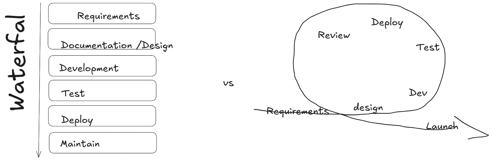

# Agile Developement

> Learning Goals
> Assessment Test
>- Recap of Agile
>- Agile vs. Waterfall
>- Recap of Stories and Epics
>- Project Managment
>- How Git and Github can help with Agile Dev
>   - Pull Requests, CI/CD, GitHub Projects
>   - Show how GitKraken can help here


**Last Session**

- Stacks
    - LIFO : last in,first out
        - like a cafeteria dispenser
    - use cases:
        - Web browser history
        -  Undo mechanism in text editors
- What is the benefit of using stacks in above's use cases?
    - the big O is optimal for LIFO operations:
```python
from array_stack import ArrayStack

S = ArrayStack()

S.push(element) # O(1) (*) 
S.pop()         # O(1)
```

- (*) these O(1) are amortized: in rare cases instead of O(1)
    - we have O(n)
    - the reason for that was the python list in ArrayStack
    - when you create a list python dynamically allocates memory
        - and when it capacity limit is reach the memory is resized and
        - all elements need to be copy --> O(N)
- practical examples where 
    - reversing Text
    - checking for matching brackets

- Queues
    - FIFO: First In, First Out
    - Examples
            - Supermarket queue
            - Customer service call handling
            - Restaurant wait lists.
        - computer applications:
            - Networked printers process jobs in FIFO order.  
            - Web servers respond to requests in FIFO order.
    - `Q.enqueue`
    - `Q.dequeue`
- from collect import queue

### Why is it important to talk about how to develop a project?

- to keep dev cost low
- deliver as fast as possible

## What is agile?

- in the last 20 years the number of companies calling themselves "Agile" increased by orders of magnitude
- The number of teams actually taking an agile approach
to their work? - Not so much.
- The term "Agile" became enormously popular.

### Agile's Genesis

- in the 1990s software dev was believed to be in crisis.
    1. software projects were overbudget
    2. late
    3. did not meet requirements
- nearly one-third of them were cancelled outright.
- but agile was not the response to this.
    - but the following:

- to bring software dev under control, 
    - big organizations created highly detailed and controlled processes:
        1. documentation of system requirements
        2. software architects would translate these documents in a detailed design document
        3. 1. programmers would translate this into code
        3. 2. meanwhile test leads would us the same document and generate test plans
        4. when code was done, armies of QA personal would manually test and report

These phase-based approaches are called *waterfall development* or *phase-gate development*.

- everything was strictly defined and controlled
- if a project did not succeed (less than 1/6 succeeded) more detail was added
- a massive amount of docs was the result

This was not a good way to work. It was bureaucratic and dehumanizing.

- Therefore, other methods were developed called "light weight methods"
They had names like:
- Adaptive Software Development
- Crystal
- feature-driven development
- dynamic systems development method
- extreme programming
- kanban
- and scrum

In 2001, 17 supporters of those methods met:
- they wanted to unifying their efforts:

**The Agile Manifesto** was born.

1. Individuals and interactions over processes and tools
2. Working software over comprehensive documentation
3. Customer collaboration over contract negotiation
4. Responding to change over following a plan

https://agilemanifesto.org/principles.html

- you can't use or do agile, you can only be agile
- after all agile is philosophy. A way of thinking about software dev. 

### Adaptive rather than predictive

In Waterfall projects a project's success was rated:
1. `Success`:
   The project is completed on time and on-budget, with all featured and functions as originally specified.
2. `Challenged`:
    The project is completed and operational but over-budget, over the time estimate, and offers fewer features and functions than originally specified
3. `Impaired`:
    The project is canceled at some point during the development cycle.

In contrast agile team define success differently:
- success is delivering value
- agile teams actively change their plans to increase this value

### People-oriented rather than process-oriented
- Heavyweight processes tried to prevent errors by carefully defining every aspect of software development. 
- Individual skill became less important.
    - In theory, you could apply the same process over and over, with different people, and get the same results.

### Why Agile won

- the problem was the heavyweight approaches
- the process designed to prevent problems actually caused problems
- get feedback (from customers) and learn and respond is at the heart of Agile
- Software was shipped (by the waterfall approach) that customers did not need
- agile teams make software visible (software instead of documents)

### A Typical Heavyweight Failure
- 2005, the FBI wasted $104.5 millon dollor
- a project to replace the bureau's case management software
- it started 2001 and took 4 years
- 2003 the FBI discovered that the software was unusable
- the contractor ask for another year and $56 millon
- 2004 the project was cancelled

### Why agile fails

- instead of "Let's get better results by adapting and putting people first"
    - leaders start saying ".. Get me some Agile"
- uncomfortable ideas like adaptive planning and people-centric are ignored
- you can't buy agile



### What are stories, epics, and initiatives?

- **Stories**, also called “user stories,” are short requirements or requests written from the perspective of an end user.
    - A user story is the smallest unit of work in an agile framework.
    - User stories describe the why and the what behind the day-to-day work of development team members

- **Epics** are large bodies of work that can be broken down into a number of smaller tasks (called stories).
- **Initiatives** are collections of epics that drive toward a common goal.

### Project Management Process
**1. Project initiation**
**2. Project planning**
**3. Project execution.**
**4. Project performance.**

## How GitHub Supports Agile Development

### **1. Enabling Continuous Integration and Continuous Deployment (CI/CD)**
- Agile emphasizes **frequent releases and rapid feedback loops**.
- GitHub Actions allows teams to set up **automated testing, deployment, and build pipelines**.
- Developers can push code and immediately receive feedback on potential issues, ensuring a **fail-fast approach**.

### **2. Collaboration and Transparency with Pull Requests**
- Agile teams prioritize **frequent feedback and peer review**.
- GitHub’s **pull request (PR) system** fosters collaboration by allowing developers to review, comment, and suggest improvements before merging code.
- **Code reviews** help maintain quality, ensure best practices, and align development with Agile values.

### **3. Agile Boards with GitHub Projects**
- GitHub Projects provides **Kanban-style boards** that support Agile workflows.
- Teams can **prioritize work**, manage sprint backlogs, and track progress using **custom workflows**.
- Issues and PRs can be directly linked to project boards for better visibility.

### **4. Managing User Stories and Issues**
- GitHub Issues act as **user stories, tasks, and bugs**, making them a flexible tool for managing Agile development.
- Teams can **tag, categorize, and assign issues** based on priority.
- Issue templates help standardize how stories and tasks are created and tracked.

### **5. Version Control and Branching Strategies**
- Agile encourages **iterative development** and frequent changes.
- GitHub allows teams to implement branching strategies such as:
    - **Feature branches** (for working on individual user stories or tasks).
    - **Release branches** (for managing stable versions).
    - **Hotfix branches** (for urgent bug fixes).
- This keeps the **main branch stable** while allowing rapid experimentation and development.

