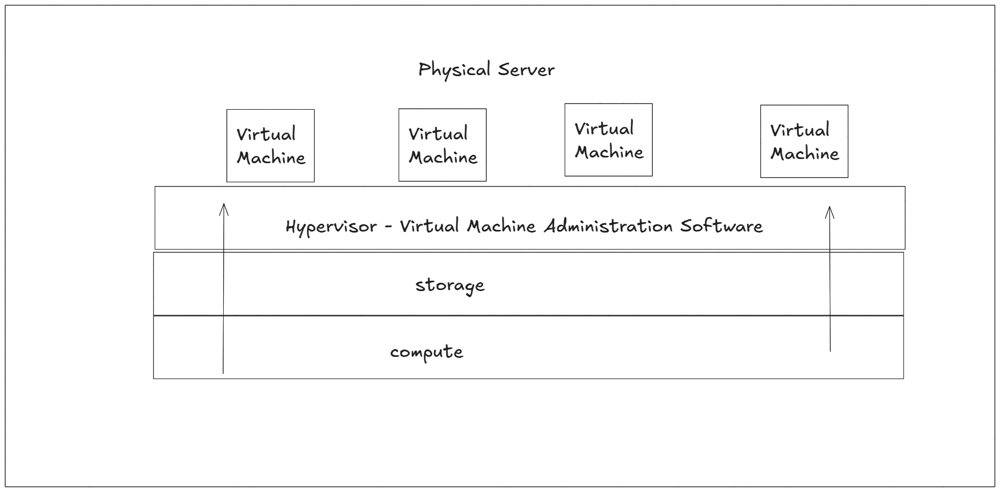
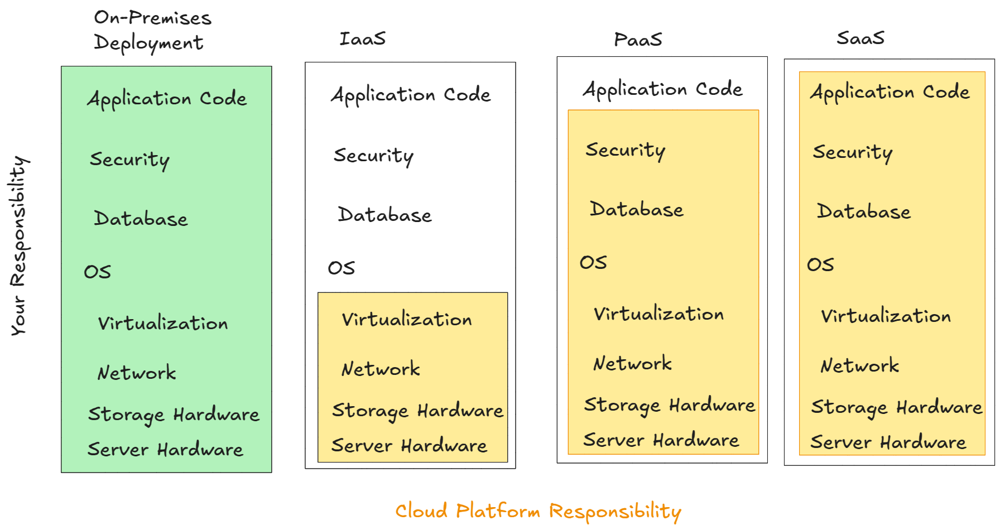

# Cloud - Introduction - 01: What is the Cloud?

> Learning Goals
>- Understand the term 'Cloud'
>- Understandaning Available and scalable in the context of the cloud
>- the metered payment models in aws
>- list and discuss all cloud platform models
>- Elasticity in the context of the cloud
>- show an example for a cloud provider: aws
>- discuss what is an ec2 on aws and    
    >- lunch one ec2 instance

**Last Session**

- asynchronous programming in python
    - we can use classic --> her we have to use a decorator:  `@asyncio.coroutine`
    - and native coroutines --> her we had to use `async` keyword

What are `awaitables`?

- awaitables can only be executed in `async` functions or in an event loop
- are the only type that can be executed by the await
examples for awaitables:
- `native coroutines` objects
- `asyncio.Task`
    - asyncio.create_task()
    - asyncio.as_completed(coroutine_lst)  ---> the first completed task/coroutine is returned and so on
    - asyncio.gather(*coroutine_lst) ---> waits until all coroutines are finished and then it return a list of its results

```python
import asyncio
import time

async def say_after(delay, what):
    await asyncio.sleep(delay)
    print(what)

async def main():
    task1 = asyncio.create_task(
        say_after(2, 'hello'))

    task2 = asyncio.create_task(
        say_after(1, 'world'))

    print(f"started at {time.strftime('%X')}")

    # Wait until both tasks are completed (should take
    # around 2 seconds.)
    # coroutine objects
    await task1
    await task2

    print(f"finished at {time.strftime('%X')}")

asyncio.run(main())
```

## What Is Cloud Computing?

Using a public cloud is about using other people's servers to run your digital workloads.
- there’s no significant difference between running a software application on servers hosted in your own office versus locating it within Amazon’s infrastructure. 

- In both cases, you need to make sure you've got sufficient
    1. compute, 
    2. memory, 
    3. network, and
    4. storage resources 

- In both cases, you want
    - fast deployments and 
    - avoiding over-provisioning ( allocating more resources than needed)

But, particularly when it comes to the largest cloud providers, there are important
differences. 

the sheer size of a platform like AWS  means it can offer you service, cost, and reliability
performance that you could never re-create

### Highly Available and Scalable Resources

What AWS can do:
- Design multiple layers of redundancy so that whenever one component fails, its
workload is automatically and instantly moved to a healthy replacement.

- Connect resources in geographically remote locations so that the failure of one
complete region could trigger a predefined relocation.
This relocation can be
supported by a similarly automated rerouting of network requests.

- Provide customers with access to as much compute power as they could possibly
need, and deliver that power on-demand.

- Because of the scale and efficiency of the platform, AWS can do all that at a price
that’s often far below what it would cost to run comparable workloads locally.


## Professionally Secured Infrastructure

- IT security is a constantly moving target. 


- the underlying server infrastructure is just a further surface of attack to worry about.
    - besides protecting the workstations and networking hardware

- No matter how good your IT security team is, they’re probably not better informed,
equipped, and trained than their counterparts at a major cloud provider. 
- this is one area where outsourcing will usually make sense. 

- AWS promotes the `Shared Responsibility Model`:
    -  that means the security and integrity of the resources you run on the cloud are still your problem. 

### Metered Payment Model

- One of the defining characteristics of any public cloud computing platform is 
    - the way it automatically allocates resources to meet client requests. 
- for instance, log in to the AWS browser console, and define and launch a virtual 
server, and moments later your new instance/server will 
be ready for you. 
- There’s no need to wait for manual intervention by AWS employees. 

- The flexibility of the self-serve system permits usage patterns that would have been
impossible using traditional compute paradigms. 

- Let’s say you need to quickly test a possible application configuration you're working on. 
- In the old days, even if the test lasted only an hour, 
    - you would still need to find free capacity on a physical server
- Once the test ended, 
    - you'd still be paying the maintenance and ownership costs of that server capacity even if it was idle.

- In the cloud, by contrast, 
    - start server,
    - run it as long as the test requires,
    - and then shut it down.

- You'll be billed for only that testing time, 
    - which, in some cases, could cost you a fraction of a penny.

- Since there’s no human processing involved in cloud compute billing, it’s as easy
for a provider to charge a few pennies as it is thousands of dollars. 

- This `metered payment` makes it possible to consider entirely new ways of testing and delivering your
applications,
- and it often means your cost-cycle expenses will be considerably lower than they would if you were using physical servers running on-premises.

- for On-premises infrastructure need a lot of capital 
    - since you need to purchase loads of expensive hardware up front. 
- Cloud operations, on the other hand, you don't need to buy any hardware for your infrastructur. 
- Instead, your costs consist mostly of per-hour resource rental fees.


### Server Virtualization: 

- what lets cloud providers give their customers on-demand compute
resources *in such a wide range of configurations* is `virtualization`. 

- When you request a virtual machine (VM) with a 
    - particular processor speed, 
    - memory capacity, and 
    - storage size, 

- AWS doesn’t send some random engineer running through the halls of its data
center looking for an available machine with this exact request hardware setup 

Rather AWS carves the necessary resources from larger existing
devices.



For example, a 5 TB storage drive could be divided into dozens of smaller virtual
volumes, each associated with a different virtual server.

And the resources
of a single physical server could be invisibly shared between multiple instances. 

### The virtualization model benefits:

- Speed: 
    - Restarting a VM can sometimes happen **faster** than you can type your login details.
    - in contrast: Defining, purchasing, provisioning, testing, and launching a new physical server can take **months**. 

- Efficiency: 
    - It's rare to find a nonvirtualized physical server that utilizes anywhere near 100 percent of its capacity. 
    - More likely, either it'll spend its time running mostly empty 
    - or it'll be badly overused while you wait for more capacity to come online.
    - on the other hand Multiple virtual machines can be tightly packed onto a physical server 
        - that runs a a hypervisor (a common technology for hosting VMs)
    - When space opens up on one server, you can quickly fill it with another virtual workload. 
    - When a server reaches capacity, overflow workloads can be moved to another machine. 
     - And the more workloads you're managing, the more flexible everything gets.

Amazon's scale and logistical abilities mean that it’s often able to leverage
the benefits of virtualization to provide both superior performance and pricing.


### Cloud Platform Models
- Cloud services come in more than one flavor.

- these differ about how much fine control you get

1. Infrastructure as a Service (IaaS)
    - generally simulate the look and feel you'd get from managing physical resources.
    - IaaS products give you direct access to a provider's compute, storage, and networking assets.
    - you—rather than the IaaS provider—are responsible for the consequences of any bad configurations. 
    - The trade-off is that you get to closely configure every layer of your operating stack.

AWS IaaS products include: 
- Elastic Compute Cloud (EC2) for virtual machine instances, 
- Elastic Block Store (EBS) for storage volumes, and 
- Elastic Load Balancing.

2. Platform as a Service (PaaS) 
 - Unlike IaaS, Platform as a Service (PaaS) products simplify the process of building an application by hiding the complexity of the infrastructure that runs it.
 - You're given an interface through which you define the behavior and environment you want for your application.

AWS PaaS products include 
- Elastic Container Service (ECS).

3. Software as a Service (SaaS)

- Software as a Service (SaaS) products offer services meant to be accessed by end users.
- An easily recognizable illustration is Google’s Gmail service, which allows users to
manage their email by logging in to a browser interface or through an email client (like
Microsoft Outlook) that’s running locally.
- Adobe
- office 365
- AWS SaaS products include Simple Email Service and Amazon WorkSpaces.



in image-1 we compare the scope of responsibility you have on IaaS, PaaS, and SaaS
platforms with the way it works for on-premises deployments.


