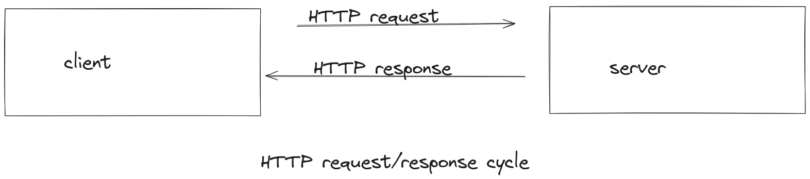
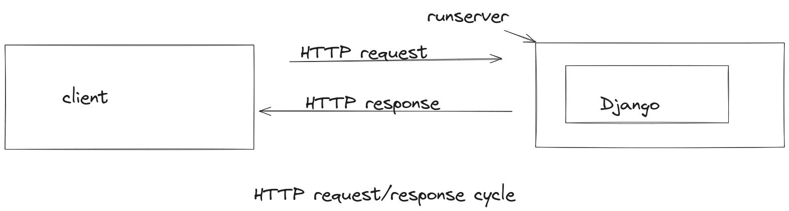
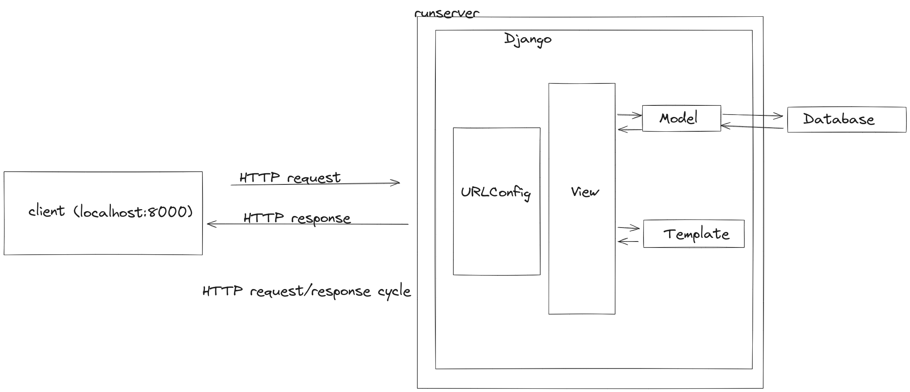

# Django - Views & Templates - 01: Understanding the Fundamentals of the Internet, the World Wide Web, and Web Development with Django

> Learning goals
>- Grasp the basic concepts World Wide Web
>- HTTP protocol that underpins web communication
>- Learn how to use Django for creating dynamic websites
>- Model-View-Controller vs Model-View-Template
>- Class based views vs. function based view
>- Templates
>- Extending templates

**Last Session**

- within a django project we added an app
    - in the app we used a view (views.py) (and we used a function based view)
    - in this view we returned a response
- we discussed the structur of an app:
    1. views.py
    2. models.py - here we define the structure of our database table
    3. urls.py - here we can define the URL PATH
        - we have two urls.py - one in our main django project directory
            - and one urls.py we have to create in our app
- Fullstack: 
    - frontend: javascript: e.g. reactjs
    - backend: python: django
        - database: sqlite3


## How Websites Work - fundamentals behind the Internet and the World Wide Web

- The Internet is a broad global system of interconnected computers;
- the World Wide Web is a subset of the Internet that refers to hypertext documents linked together via hyperlinks (in other words, webpages)

- The internet relies on various “communication protocols” 
- they are are like human languages in that they allow computers all over the world to communicate with one another via agreed-upon conventions.

For example,
1. viewing webpages uses the Hypertext Transfer Protocol (HTTP).
2. file sharing uses the File Transfer Protocol (FTP),
3. communicating through voice uses the Voice over Internet Protocol (VoIP)
4. sending email uses the Simple Mail Transfer Protocol (SMTP), 

#### “World Wide Web”

- Underpinning the world wide web is the **client-server model**. 
    - client: webbrowser, a dishwasher and its software (makes requests)
    - server:  is computer hardware or software that responds to service requests. (responses to requests)

- The computers powering the internet are often referred to as servers
- but they’re just computers connected to the internet all the time running special software that lets them “serve” information to other computers.

- Your own computer can be a server, 
    - but in practice most servers exist in large data centers (aka “the cloud”).

Since we are using the HTTP protocol for all of this,
    we can be more specific and say that a client makes an HTTP request and a server responds with an HTTP response.



- The full domain name for a website like LearnDjango.com is actually https://learndjango.com. 
- The https:// at the beginning specifies that we are using HTTP as our protocol: 
    - HTTPS is the encrypted version of HTTP and now accounts for the majority of web traffic. 
- Modern web browsers will automatically add this on for you
- most regular users simply type the domain name and are unaware of the HTTP underpinnings.
- Each time you type a URL address into your web browser an HTTP request is sent to the appropriate server which then returns an HTTP response. 

- Your web browser then renders the data from the HTTP response to create a webpage. 
- Every time you click on a link or request a new URL this HTTP request/response cycle begins again. 
- Back and forth the communication goes.

- In production, a Django website like LearnDjango.com is hosted on a physical server and automatically processes HTTP requests and responses. 

In local development, things are much simpler.
- Django comes with a lightweight development server(runserver) that manages HTTP requests and responses,
- Django generates dynamic content from the database and serves static files (more on these later). 

We can therefore update our first image with a new one featuring runserver wrapped around Django:



### Static vs Dynamic Websites

- There are two broad categories of websites: static and dynamic. 
- static website: 
    - it just presents content without any addition features (no login; data retrieval, because lack of database)
    - content does not change, except by changing the underlying html files (hardcoded)
    - no database
    - consists of individual HTML documents that are sent over HTTP to your web browser. 
    - If your website has ten pages then there must be ten corresponding HTML files. 
    - This approach can work for very small websites but quickly falls apart when a website needs hundreds or thousands of pages. 
- dynamic websites:
    - has a database
    - HTML templates
    - application server that can update the files before sending them to your browser via HTTP
    - Most large websites adopt this approach since it means millions of webpages can be composed of only a few HTML templates,
        - a small amount of logic, and a big database.
    - Django is designed for dynamic websites and abstracts away much of the difficulty inherent in creating a website from scratch.
    If you think about it, most websites require the same fundamental tools:

    - a way to process URL requests
    - a way to connect to a database
    - a way to generate dynamic content by filtering data from the database
    - a way to create templates for styling HTML and adding CSS, images, etc 

### Model-View-Controller vs Model-View-Template

- the Model-View-Controller (MVC) pattern is used by web frameworks including Ruby on Rails, Spring (Java), Laravel (PHP), and ASP.NET (C#)
- This is a popular way to internally separate the data, logic, and display of an application into separate components
    - for devs it's easier to reason about

In the traditional MVC pattern there are three major components:
- Model: Manages data and core business logic
- View: Renders data from the model in a particular format
- Controller: Accepts user input and performs application-specific logic

Django’s approach is sometimes called Model-View-Template (MVT) but it is really a 4-part pattern that also incorporates URL configuration. 

Something like Model-View-Template-URL (MVTU) would be a more accurate description:

- Model: Manages data and core business logic
- View: Describes which data is sent to the user but not its presentation
- Template: Presents the data as HTML with optional CSS, JavaScript, and static assets
- URL Configuration: Regular expression components configured to a View

- When you type in a URL, such as https://djangoproject.com, 

1. the first thing that happens within our Django project is that the server kicks
into gear and helps Django to look for a matching URL pattern (contained in urls.py)
2.  The URL pattern is linked to a single view (contained in
views.py) 
3. which combines the data from the model (stored in models.py) and the styling from a template (any file ending in .html). 
4. The view then returns a HTTP response to the user.



**Django request/response cycle**
- the “Django way” of doing things is more loosely coupled and allows for easier modifications than the MVC approach.


### Continue The Pages App

## Templates

Every web framework needs a convenient way to generate HTML files

- in Django, the approach is to use templates:
    - individual HTML files that can be linked together and include basic logic.

- Recall that our “Hello, World” site had the phrase hardcoded into a views.py file.
- That technically works but does not scale well.

- A better approach is to link a view to a template, thereby separating the information contained in each. 

The first consideration is where to place templates within the structure of a Django project. 

There are two options. 

By default, Django’s **template loader** will look within each app for related templates.

**Option 1**
```bash
pages
    ├── templates
    │       └── home.html
```
The home.html file will have a simple headline for now. 

```html
<!-- pages/templates/home.html --> 
<h1>Hello World</h1> 
```

**Option 2**

- another approach is to instead create a single project-level templates directory and place all templates within it.
- By tweaking our `django_project/settings.py` file, we can tell Django to also look in this directory for templates.

- create a directory called templates in the root of our django project

create a directory called templates in the main folder:

```bash
mkdir templates
```

Therefore, our folder structure will look like:

```bash
.
├── db.sqlite3
├── django_project
│   ├── asgi.py
│   ├── __init__.py
│   ├── settings.py
│   ├── urls.py
│   └── wsgi.py
├── manage.py
├── pages
│   ├── admin.py
│   ├── apps.py
│   ├── __init__.py
│   ├── migrations
│   │   └── __init__.py
│   ├── models.py
│   ├── tests.py
│   ├── urls.py
│   └── views.py
├── requirements.txt
└── templates
    └── home.html
```

Next, we need to update django_project/settings.py to tell Django the location of our new templates directory. Doing so requires
a one-line change to the setting "DIRS" under TEMPLATES.


```python
# django_project/settings.py
TEMPLATES = [
    {
        "DIRS": [BASE_DIR / "templates"], # new
    }
]
```

Create a new file called home html within the templates directory. 

The home.html file will have a simple headline for now. 

```html
<!-- templates/home.html --> 
<h1>Homepage</h1> 
```
Our template is complete! The next step is to configure our URL and view files. 

## Class-Based Views 

Early versions of Django only shipped with function-based views, 
but developers soon found themselves repeating the same patterns over and over.

1. Write a view that lists all objects in a model. 
2. Write a view that displays only one detailed item from a model. 
And so on. 

To help with code reusability, Django added class-based views and generic
class-based views while still retaining function-based views. 

There are three different ways to write a view in Django:

1. function-based
2. class-based
3. generic class-based

- Function-based views are simpler to understand because they mimic the HTTP request/response cycle 
- Class-based views are a little harder to understand because their inheritance structure means you have to dive into the code to see everything happening;

So why bother with generic class-based views?
Once you have used them for
a while, they become elegant and efficient ways to write code.

You can often modify a single method on one to do custom behavior rather than rewriting everything from scratch.
When a generic class-based view is not enough, modify it to suit your needs.

And if that still isn’t enough, revert to a function-based or class-based view. 

**function-based view**

```python
from django.shortcuts import render

def home_page_view(request):
    return render(request, "home.html")

```

**Function-based view:**
- The function takes an HTTP request as input and uses render to combine the template with any optional context and return an HttpResponse.

**Class based view**
for class based view we will use TemplateView (one of the generic views) to display our template.

Replace the the pages/views.py file with the following Code:


```python
# pages/views.py
from django.views.generic import TemplateView

class HomePageView(TemplateView):
    template_name = "home.html" 
```

- Note that we've used PascalCase to name our view, HomePageView, meaning the first letter of each word is capitalized. 
- This is  used for class names in Python. 

- The TemplateView already contains all the logic needed to display our template; 
- we just need to  specify the template’s name. 

## URLs

We will make one significant change to the pages/urls.py file: when using Class-Based Views, you always add as_view() at the end of the view name. 

```python
# pages/urls.py 
from django.urls import path 
from .views import HomePageView 


urlpatterns = [ 
    path("", HomePageView.as_view(), name="home"), 
]
```

And we're done! Start the local web server with the command python manage.py runserver and navigate to 
http://127.0.0.1:8000/ to see our new homepage. 


## Extending Templates

If you think about most websites, the same content appears on every page:
- header, 
- footer, 


- Let’s create a base.html file containing a header with links
to our two pages. 
- We could name this file anything, but using base.html

```bash
└── templates
    ├── about.html
    └── home.html
    └── base.html
```

Django has a minimal templating language for adding links and basic logic in our templates. 

Template tags take the form of  where the “something” is the template tag itself. 

- To add URL links in our project, we can use the built-in **url** template tag:
    - takes the URL target name as an argument
    - The url tag uses these names to create links for us automatically.

- The URL route for our homepage is called `'my_home'`.
- To configure a link to it, we use the following syntax:

.

```html
#base.html
<header>
  <a href="">Home</a>
  <a href="">About</a>
</header>

 
```

At the bottom, we've added a block tag called content.

- The Django templating language comes with an extends method that we can use for this.

```html
#Home




<h1>Home</h1>

```

Now if you start up the server with python manage.py runserver and open up our webpages again at http://127.0.0.1:8000/,
the header is included.
