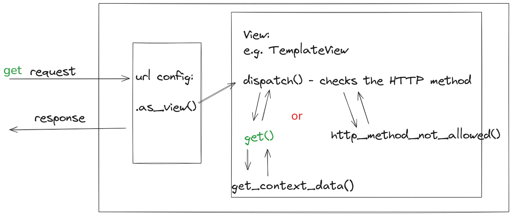

# Django - Views & Templates - 03: Templates & Lifecycle of a TemplateView

> Learning Goals
>- Templates: Tags vs. filter
>- Custom template tags
>- Overview: HTTP Method
>- function based vs. class based views
>- Lifecycle of a class based view

**Last Session**
- testing in django
    - django comes with its own testing Framework
    - it is built on top of unittest
    - in unittest we have assert methods like `self.assertEquals`
    - django adds further assert methods like `self.assertContains, self.assertTemplateUsed`
- request and response objects
    - request methods:
        - `.GET`
        - `.method`
        - `.POST`
        - `.META`
        - `.COOKIES`
        - `.FILES`
    - types of response objects in Django:
        - HttpResponse (explicitly or use render)
        - HttpResponseForbidden
        - HttpResponseServerError
            - they differ in status code
        - jsonResponse
    - response objects methods:
        - `.write('content')`
        - `.set_cookie(key, value)`
        - `.delete_cookie(key)`

How to send data to a template via the view?
```python
def my_view(request):
    return render(request, 'home.html', {'key': 'value', 'data': [1,2,3]})
```


### Built-In Template Filters

- Filters are simple functions used to modify or format variables.
- Applied directly to variables using the | (pipe) symbol.

#### **`add` Filter**
- Adds two values (e.g., numbers, lists) or concatenates them if possible.
- **Examples:**
  ```html
  {{ 4|add:"2" }}  <!-- Output: 6 -->
  {{ numbers|add:numbers }}  <!-- Output: [1, 2, 3, 1, 2, 3] -->
  ```

  #### **`lower` Filter**
- Converts a string to lowercase.
- **Example:**
  ```html
  {{ "WELCOME TO DJANGO!"|lower }}  <!-- Output: welcome to django! -->
  ```

#### **`date` Filter**
- Formats a datetime object into a human-readable string.
- **Example:**
  ```html
  {{ today|date:"D d M Y" }}  <!-- Output: Thu 09 Jan 2025 -->
  ```

for all format characters see : https://docs.djangoproject.com/en/5.1/ref/templates/builtins/#date


### Looping and Conditions in Templates

#### **Context Example:**
- View passes a list to the template:
  ```python
  context = {
      'numbers': [1, 2, 3],  # List of numbers
  }
  ```

#### **Loop and Conditional Logic in Template using template tags:**

- Use `` to iterate through the list and `` to apply conditions.
  ```html
  <ul>
      
          <li>
              
                  The number is one.
              
                  The number is two.
              
                  The number is something else: {{ number }}.
              
          </li>
      
  </ul>
  ```

### Explanation of Template Code

- **``**:
  - Loops through each item in the `numbers` list.
  
- **``, ``, ``**:
  - Implements conditional logic:
    - If `number == 1`: Renders "The number is one."
    - If `number == 2`: Renders "The number is two."
    - Otherwise: Renders "The number is something else: {{ number }}."

- **``**:
  - Ends the loop.

  ### Resulting HTML Output
```html
<ul>
    <li>The number is one.</li>
    <li>The number is two.</li>
    <li>The number is something else: 3.</li>
</ul>
```

## Custom template tags

- Template tags are functions.
- Custom template tags must be defined in a directory named `templatetags` inside an app directory.
- The directory must have an empty __init__.py file.
- The app must be in the INSTALLED_APPS settings constant.
- We can have as many files as we want with any name we want.
- The file with the template tag definition must be loaded in the template, using the load built-in tag.
- The template tag function must be registered in the library.
- It can be done with the simple_tag decorator.

```bash
├── db.sqlite3
├── django_project
│   ├── asgi.py
│   ├── __init__.py
│   ├── settings.py
│   ├── urls.py
│   └── wsgi.py
├── manage.py
├── pages
│   ├── admin.py
│   ├── apps.py
│   ├── __init__.py
│   ├── migrations
│   │   └── __init__.py
│   ├── models.py
│   ├── templatetags
│   │   ├── __init__.py
│   │   └── my_tags.py
│   ├── tests.py
│   ├── urls.py
│   └── views.py
├── requirements.txt
├── templates
│   ├── about.html
│   ├── base.html
│   └── home.html
└── test.py
```

### Example Custom tag: "Simple tag"

django_project2/pages/templatetags/my_tags.py:

```python
from django import template

register = template.Library()

@register.simple_tag
def hello_world():
    return 'Hello World'
```

templates/home2.html 

```html



<h1></h1>
```


- Multiple template tag modules, custom and built-in, can be loaded.
- Custom tags may also accept arguments.
- The inclusion_tag decorator is a shortcut for a template renderer.

#### adding arguments

```python
#pages/templatetags/my_tags.py:
from django import template

register = template.Library()

@register.simple_tag
def hello_world(greeting='hello', name='bob'):
    return f" Hello world {greeting}, {name}!"
```

and

```html





<body>
    <h1></h1>
    <h1>{{ title }}</h1>
</body>


```

### Inclusion_tag

The inclusion_tag is a feature of Django's templating system that lets you define a template tag that renders a specific template.

### Step 1: Define the `inclusion_tag` to accept an argument

Create `footer_tags.py`:

# pages/templatetags/footer_tags.py

```python
from django import template

register = template.Library()

@register.inclusion_tag('footer.html')
def render_footer(company_name="My Comany"):
    return {'company_name': company_name}
```

### Step 2: Create the template to be included

Create `footer.html`

```html
<!-- templates/footer.html -->
<footer>
    Copyright &copy; {{ company_name }}.
</footer>
```

### Step 3: Use the `inclusion_tag` with an argument in another template

Load the templatetag and use `render_footer` with a specified company name:

```html


... rest of your template ...


```

Now, when this template is rendered, the footer will display:

```
Copyright © AwesomeCo.
```

By providing default values in the inclusion tag definition (like "My Company" in our example), you ensure that the tag remains flexible.
It can be used with or without specifying the company name. If no name is provided, it'll default to "My Company".


## HTTP Methods

HTTP methods are standardized request types used in the HTTP protocol to indicate the desired action to be performed on a resource.
Each method corresponds to a specific operation, and they are commonly used in web development for client-server communication.

- These methods ensuring that operations are predictable and standardized

### Common HTTP Methods:
1. **GET**:
    - **Purpose**: Retrieve data from the server.
    - **Characteristics**:
     - Should not modify server state (read-only).
     - Parameters often sent via the URL query string.
    - **Example**: Fetching a webpage or a list of users.
    - **Example Request**: 
        - `GET /users/`
        - `GET /user/1`
2. **POST**:
    - **Purpose**: Submit data to the server to create a resource
    - **Characteristics**:
     - Typically modifies server state.
     - Data is sent in the request body.
     - Not idempotent (repeating the request may create duplicates).
    - **Example**: Submitting a form or creating a new user.
    - **Example Request**: `POST /user/` with JSON payload `{ "name": "Alice" }`
3. **PUT**:
    - **Purpose**: Update a resource (idempotent)
    - **Characteristics**:
     - Fully replaces the resource if it exists
    - **Example**: Updating a user's profile.
    - **Example Request**: `PUT /user/1/` with JSON payload `{ "name": "Alice2" }`
4. **PATCH**:
    - **Purpose**: Partially update a resource.
    - **Characteristics**:
     - Modifies only specified fields of the resource.
    - **Example**: Updating just the email of a user.
    - **Example Request**: `PATCH /user/1/` with JSON payload `{ "email": "alice@example.com" }`
5. **DELETE**:
    - **Purpose**: Remove a resource from the server.
    - **Characteristics**:
     - Idempotent (deleting the same resource multiple times has the same effect).
    - **Example**: Deleting a user.
    - **Example Request**: `DELETE /users/1/`


### Less Common HTTP Method:
6. **HEAD**:
    - **Purpose**: Similar to `GET` but retrieves only headers, not the body.
    - **Use Case**: Checking resource existence or metadata.


Each method is designed to perform specific actions, ensuring clear and consistent communication between the client and server.


# Class-based views

- A view is a callable which takes a request and returns a response. 
- This can be more than just a function
- Django provides examples of some classes which can be used as views. 
- These allow you to structure your views and reuse code by harnessing inheritance and mixins. 
- There are also some generic views for common tasks,
    - but you may want to design your own structure of reusable views which suits you

differences and advantages when compared to function-based views:
- Organization of code related to specific HTTP methods (GET, POST, etc.) can be addressed by separate methods instead of conditional branching.
- Object oriented techniques such as mixins (multiple inheritance) can be used to factor code into reusable components.

What is a mixin?

- In Django (and programming in general), a mixin is a special kind of class that provides reusable functionality to other classes. 
- Mixins are used to add or "mix in" specific behavior to a class
- A mixin is not meant to be instantiated on its own but rather to be used in conjunction with other classes.

### Using class-based views

At its core, a class-based view allows you to respond to different HTTP request methods with different class instance methods, instead of with conditionally branching code inside a single view function.

```python
from django.http import HttpResponse


def my_view(request):
    if request.method == "GET":
        # <view logic>
        return HttpResponse("result")
```

n a class-based view, this would become:


```python
#view.py
from django.http import HttpResponse
from django.views import View


class MyView(View):
    def get(self, request):
        # <view logic>
        return HttpResponse("result")
```


```python
# urls.py
from django.urls import path
from .views import MyView

urlpatterns = [
    path("about/", MyView.as_view()),
]
```

- Because Django’s URL resolver expects to send the request and associated arguments to a callable function, not a class, 
- class-based views have an `as_view()` class method which returns a function that can be called when a request arrives for a URL matching the associated pattern. 
- The function creates an instance of the class and initialize its attributes
- then the `dispatch()` method is called. 
- `dispatch` looks at the request to determine whether it is a GET, POST, etc, and relays the request to a **matching method** if one is defined, or raises `HttpResponseNotAllowed` if not

- what your method returns is identical to what you return from a function-based view, 
- This means that http shortcuts or TemplateResponse objects are valid to use inside a class-based view.

#### TemplateView
- Renders a given template, with the context containing parameters captured in the URL.

**Method Flow**
1. setup():
    - Performs key view initialization prior to dispatch().
    - If overriding this method, you must call super().
2. dispatch()
    - the method that accepts a request argument plus arguments, and returns an HTTP response.
    - The default implementation will inspect the HTTP method and attempt to delegate to a method that matches the HTTP method; 
    - a GET will be delegated to get(), a POST to post(), and so on.
    - The `TemplateView` contains a `get method`
3. http_method_not_allowed()
    - If the view was called with an HTTP method it doesn’t support, this method is called instead.
4. get_context_data():
    - Returns a dictionary representing the template context. 
    - The keyword arguments provided will make up the returned context.
    - the TemplateView's `get method` calls the `get_context_data()`


Let's rewrite yesterday's function-based view 
```python
def home_func_view(request):
    print(request.method) # GET
    print(request.GET) # GET Parameters
    print(request.COOKIES)
    context = {
        'key1': 'value1',
        'key2': 'value2',
        'title': 'Hello World',
    }
    return render(request, "home.html", context)

```

to a generic class based view:

```python
from django.http import HttpResponse
from django.views.generic import TemplateView

class HomePageView(TemplateView):
    template_name = "home.html"

    def get(self, request, *args, **kwargs):
        print(request.method)
        print(request.GET)
        print(request.COOKIES)

        # If the condition is not met, proceed with the normal rendering process
        return super().get(request, *args, **kwargs)

```

How to add context?

```python
from django.http import HttpResponse
from django.views.generic import TemplateView

class HomePageView(TemplateView):
    template_name = "home.html"

    def get(self, request, *args, **kwargs):
        print(request.method)
        print(request.GET)
        print(request.COOKIES)

        # If the condition is not met, proceed with the normal rendering process
        return super().get(request, *args, **kwargs)

    def get_context_data(self, **kwargs):
        context = {
            'title': 'Welcome to my Site',
            'today': datetime.now(),
            'numbers': [1, 2, 3, 'bla', 'Hello world'],
            'dic': {'one': 'dict1', 'two': 2 },
        }
        return context
```
