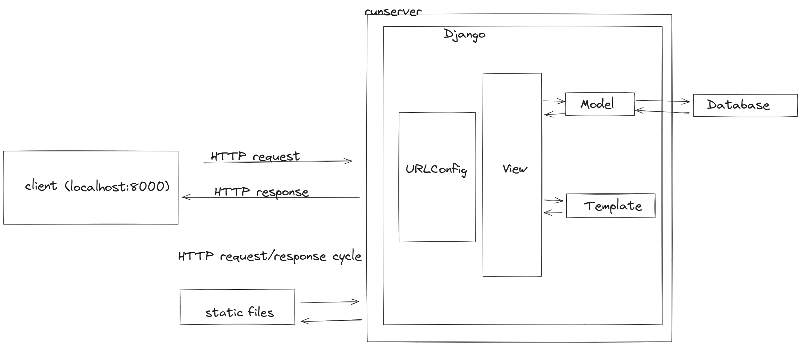

# Django - Message Board App - 02: Setting Up Views, Templates, URLs, Static Files, and Testing in a Django Project

> Learning Goals
>- ListView
>- ListView vs. TemplateView vs. function-based View
>- ORM model manager
>- static assets (js, css, images)
>- testing this project (which includes a database)

**Last Session**
- Mixin: in django we can "mix in" authentication for dedicated view
    - in general: are used in multiple inheritance and adds functionality

```python
class ParentClass:
    template_name = None
    model = None

    def dispatch(...)

    def get_context_data(....):
        return {'posts': Posts.objects.all()}

    
    def get(self, request, *args, **kwargs):
        if template_name and if model:
            return render(request, self.template_name, self.get_context_data(....))

    ......

class MyMixin:
    def get(self, request, *args, **kwargs):
        if request.user == 'admin':
            return super().get(request, *args, **kwargs) # render(request, self.template_name)
        return HttpResponseForbidden


class MyHome(MyMixin, ParentClass):
    template_name = 'home.html'
    model = Post

class MyAbout(MyMixin, ParentClass):
    template_name = 'about.html'
    model = Comments

class MyContact(MyMixin, Parent2Class):
    template_name = 'contact.html'
    

#Without Mixins: We are repeating ourselves

class MyHome(ParentClass):
    template_name = 'home.html'
    model = Post

    def get(self, request, *args, **kwargs):
        if request.user == 'admin':
            return super().get(request, *args, **kwargs) # render(request, self.template_name)
        return HttpResponseForbidden


class MyAbout(ParentClass):
    template_name = 'home.html'
    model = Post

    def get(self, request, *args, **kwargs):
        if request.user == 'admin':
            return super().get(request, *args, **kwargs) # render(request, self.template_name)
        return HttpResponseForbidden

class MyHome(ParentClass):
    template_name = 'home.html'
    model = Post

    def get(self, request, *args, **kwargs):
        if request.user == 'admin':
            return super().get(request, *args, **kwargs) # render(request, self.template_name)
        return HttpResponseForbidden
```

- orm & model:
    - model:
    ```python

    class Post(models.Model):
        text = models.TextField()
    ```

- we have a 2-step process to update our database in Django:
    - `python manage.py makemigrations app_name` ---> translate the model or its changes to a migrationfile; database is not yet affected
    - `python manage.py migrate` ---> apply the migrationfile to our database: new tables are created or changed
- to see all our applied and unapplied migrationfiles: `python manage.py showmigrations`
- admin: graphical interface to manage the data of our models

### Views/Templates/URLs

- To display database content on the homepage, we need to wire up views, templates, and URLs.
- Start with the view:
  - Previously, the homepage displayed a template using Django's built-in generic `TemplateView`.

- Goal:
    - Update the view to list the contents of a database model.
    - Use Django's generic class-based `ListView` to achieve this.

1. Open the `posts/views.py` file.
2. Replace the default text with the Python code provided below.

```python 
# posts/views.py
from django.views.generic import ListView
from .models import Post

class HomePageView(ListView):

    model = Post
    template_name = "home.html"

```

- On the first line, import `ListView` from Django's generic views.
- On the second line, import the `Post` model.

- Create the `HomePageView` by subclassing `ListView`.
- Specify the appropriate model and template for the view.

1. **URLs**:
     - Configure the URLs to route to the newly created `HomePageView`.
2. **Template**:
     - Create the template for rendering the content.

 **Template Setup**:
  - Create a new project-level directory called templates.

```Shell
(.venv) $ mkdir templates
```

Then update the DIRS field in our django_project/settings.py file
so that Django can look in this new templates directory.

```python
# django_project/settings.py
TEMPLATES = [
{
    ...
    "DIRS": [BASE_DIR / "templates"], # new
    ...
}
]
```

- then we created our template:

<!-- templates/home.html -->
<h1>Message board homepage</h1>
<ul>

    

        <li>{{ post.text }}</li>

    
</ul>
```

change of the two urls.py

```python
# django_project/urls.py
from django.contrib import admin
from django.urls import path, include # new

urlpatterns = [
    path("admin/", admin.site.urls),
    path("", include("posts.urls")), # new
]
```

and

```python
# posts/urls.py
from django.urls import path
from .views import HomePageView

urlpatterns = [
    path("", HomePageView.as_view(), name="home"),
]
```

### ORM

#### The Model Manager and QuerySets

- The model manager is a class with methods to create, delete, and access rows in the database table.
- The model manager interacts with the database to create and retrieve rows.
- The property holding the default manager is named `objects`.

```python
    Post.objects.<method_name>()
```

### The Model Manager: Methods

The most basic methods of the model manager are:
- **CREATE** 
- **GET**

- in another session:

    - **FILTER**
    - **EXCLUDE**
    - **ALL**


#### CREATE

This method stores the new data in the database and will return the model object.

```shell
(env)$ python3 manage.py shell
>>> from posts.models import Post
>>> post = Post.objects.create(text="This is my first post!") #saves it in the database
...

>>> post
<Post: Post object (1)>
>>> 

>>> post.id
1
>>> post.pk
1
post.text = "Updated post"
>>> post.save()
>>> post
<Post: Post object (Updated post)>
```

- A table created with the ORM will always have a primary key column.
    - If not defined in code, the ORM will add one named `id` (with an alias named `pk`).
    - If the model specifies a primary key with a name other than `id`, `pk` will point to that field.

- Use `save()` to store updates in the database.

#### GET

The `get` method retrieves a single model object from the database.

```shell
>>> post = Post.objects.get(id=1)
>>> print(post)
<Post: Post object (1)>
```

For better display, add the following method to your model:

```python
# posts/models.py

def __str__(self):
    return self.text[:50]  # Return the first 50 characters of the text
```

- The query arguments must return **one and only one** record.
- If more than one record is returned, an exception is raised.

```shell
>>> post = Post.objects.get(text="Duplicate post")
Traceback (most recent call last):
...
posts.models.Post.MultipleObjectsReturned: get() returned more than one Post -- it returned 2!
```

###  Replicating ListView Functionality Using TemplateView


- Transform a Django `ListView` into a `TemplateView` while replicating its functionality.

**Original Setup:**

   ```python
   from django.views.generic import ListView
   from .models import Post

   class HomePageView(ListView):
       model = Post
       template_name = "home.html"
   ```

applied to our templateView:

```python
from django.views.generic import TemplateView
from .models import Post


class HomePageTemplateView(TemplateView):
    template_name = "home.html"

    def get_context_data(self, *kwargs):
        # posts = ['hello', '2. post', 'hello again']
        posts = Post.objects.all()
        context = {
            'post_list': posts
        }
        return context
```

Now change the class-based ListView to a function-based view in your posts/views.py:

```python
# posts/views.py
from django.shortcuts import render
from .models import Post

def home_view(request):
    posts = Post.objects.all()  # Fetch all posts from the database
    return render(request, "home.html", {"posts": posts})

```

### Git

it is a good time to initialize our directory and create
a .gitignore file. 

```shell
(.venv) §$ git init
```

create a new .gitignore file in the root directory
and add three lines so that the .venv directory, Python bytecode, and the
db.sqlite file 


```shell
    .venv
    __pycache__
    db.sqlite3
```

Then add and commit the newly created and changed files:

```shell
(.venv) $ git add .
(.venv) $ git add commit -m "inital commit"
```

### Static Files

Static files are the Django community’s term for additional files
commonly served on websites such as CSS, fonts, images, and JavaScript.

Even though we haven’t added any yet to our project, we are already
relying on core Django static files-custom CSS, fonts, images, and
JavaScript-to power the look and feel of the Django admin.

- runserver will automatically find our static files we just have to specify the location of our assets in our project



