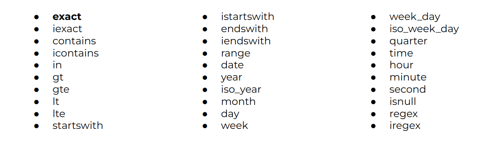

# Django - Message Board App - 02: Testing and ORM

> Learning goals
>- Testing with a database
>- continue ORM
    >- Filters
    >- Exclude
    >- Field Look Ups
    >- Ordering
    >- Aggregations
        >- Groupby
    >- Deleting & Updating
    >- Counting
    >- discuss Field types


**Last Session**
- ListView:
    - displaying all rows of model

```python

class Post(models.Model):
    text = models.TextField()
    title = models.CharField()


class HomePage(ListView):
    model = Post   # {post_list: Post.objects.all()} WITHOUT context_object_name
    template_name = "home.html"
    context_object_name = "posts"  #{posts: Post.objects.all()}
```

```html
<!--templates/home.html-->

<ul>
     # posts = [post object(1), post object (2), etc.] ; 

    <li> {{ item.text }}

    
</ul>

```

What do you have to do when you create/change your Model?

- python manage.py makemigrations app_name --> reflecting changes in a migrationsfile
- python manage.py migrate --> applies changes to the database

- ORM
    - from posts.models import Post
    - retrieves all rows: Post.objects.all() 
    - retrieving one row: post = Post.objects.get(id=1)
    - creating items:  Post.objects.create(text="Hello World!")
    - update post (has post instance as a value): 
    ```python
         post.text = 'new value'
         post.title = 'new title'
         post.save()
    ```

### Tests

Previously, we were only testing static pages, so we used SimpleTestCase. 

Now that our project works with a database, we need to use **TestCase**, which will let us create a test database.

we don’t need to run tests on our actual database but instead can make a separate test
database, fill it with sample data, and then test against it

Our Post model contains only one field, text

All test methods must start with the phrase test

We will use the hook *setUpTestData()* to create our test data.
it is much faster than using the *setUp()* hook from Python’s unittest because it creates the test data only once per test case rather than per test. 

setUpTestData() is a classmethod 

To use it, we’ll use the @classmethod function decorator. 

As PEP 8 explains, in Python it is a best practice to always use cls as the first argument to class methods.


```python
# posts/tests.py
from django.test import TestCase
from .models import Post

class PostTests(TestCase):
    @classmethod
    def setUpTestData(cls):
        cls.post = Post.objects.create(text="This is a test!")

    def test_model_content(self):
        self.assertEqual(self.post.text, "This is a test!")
```


We will want to check the following four things for our message
board page:

- URL exists at / and returns a 200 HTTP status code
- URL is available by its name of “home”
- Correct template is used called “home.html”
- Homepage content matches what we expect in the database


```python
from django.test import TestCase
from django.urls import reverse

from .models import Post

class PostTests(TestCase):
    @classmethod
    def setUpTestData(cls):
        cls.post = Post.objects.create(text="This is a test!")

    def test_model_content(self):
        self.assertEqual(self.post.text, "This is a test!")

    def test_url_exists_at_correct_location(self):
        resp = self.client.get('/')
        self.assertEqual(resp.status_code, 200)

    def test_url_available_by_name(self):
        resp = self.client.get(reverse('home'))
        self.assertEqual(resp.status_code, 200)

    def test_template_name_correct(self):
        resp = self.client.get(reverse('home'))
        self.assertTemplateUsed(resp, 'home.html')

    def test_template_content(self):
        resp = self.client.get(reverse('home'))
        self.assertContains(resp, 'This is a test!')
```

Let's now commit our changes:

```Shell
(.venv) $ git add .
(.venv) $ git commit -m "added tests"
```

# ORM

### The Model Manager: Methods (continued)

### FILTER
- The `filter` method retrieves a QuerySet of objects matching the given conditions.

```python
>>> posts = Post.objects.filter(text="Hello world")
<QuerySet [<Post: Hello world>, <Post: Hello world>]>
```

- Combine conditions using multiple arguments:

```python
>>> posts = Post.objects.filter(text="Hello world", id=1)
<QuerySet [<Post: Hello world>]>
```

Filters return a QuerySet, which can be further refined.

- chaining filters:
```python
>>> Post.objects.filter(text="Hello world").filter(id=3)
 <QuerySet [<Post: Hello world>]>
```

### EXCLUDE

- The `exclude` method retrieves all objects that do not match the conditions.

```python
>>> Post.objects.exclude(text="Hello world")
<QuerySet [<Post: This is my first post!>, <Post: MY NEW TEXT!>, <Post: Bla>, <Post: Django is a high-level Python web framework that e>, <Post: Python is a versatile language loved by developers>, <Post: Learn how the internet works and build your first >, <Post: Optimize your Django apps with caching and databas>, <Post: Learn how to deploy your Django projects to produc>]>
```

### FIELD LOOKUPS

- Field lookups define conditions using `<field_name>__<lookup>` syntax.
- They can be used with `filter`, `exclude`

``python
# Case-insensitive match
>>> posts = Post.objects.filter(text__iexact="hello world")

# Contains (substring match)
```python
>>> posts = Post.objects.filter(text__contains="World")
>>> Post.objects.filter(text__contains="hello")
>>> Post.objects.filter(text__icontains="hello") # SQLite doesn’t support case-sensitive LIKE statements; contains acts like icontains for SQLite. 

# Greater than, less than, etc.
>>> Post.objects.filter(id__gt=1)
>>> Post.objects.filter(id__lte=5)

# In list
>>> Post.objects.filter(id__in=[1, 2])
```



### VALUES

- **values**: Returns QuerySet of dictionaries:

```python
>>> texts = Post.objects.values("text")
<QuerySet [{"text": "Hello World"}, {"text": "Another Post"}]>
```

### ORDERING
- Use `order_by` to sort results:

```python
>>> posts = Post.objects.order_by("text")
<QuerySet [<Post: Another Post>, <Post: Hello World>]>
>>> posts = Post.objects.order_by("-text")  # Descending
```

- To set a default ordering:

```python
class Post(models.Model):
    text = models.TextField()
    class Meta:
        ordering = ["text"]
```