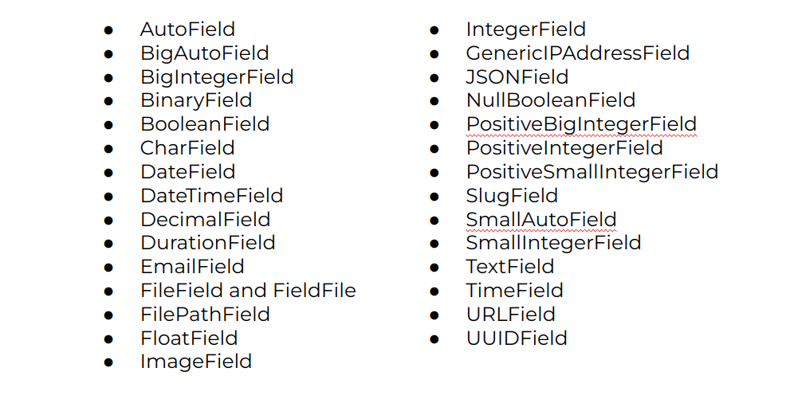

# DjangoMessage Board App - 03: ORM III

> Learning Goals
>- explain further ORM methods and Fields
>- recap static, ListView, css
>- DetailView
>- Primary Key and Foreign Key in django models
>- User Table
>- Parameterized urls / routes

**Last Session**
- test: setUpTestData()
    - we can setup data, that can be used for each test method independently
    - it avoids repetition
    - class method
- TestCase vs. SimpleTestCase:
    - TestCase is used if we need to test our database
        - SimpleTestCase does not
    - creates a TestDatabase before test methods are run
    - and tears it down after the last test method is run
- ORM:
    - filter is analogous to the SQL WHERE clause

```python
from shop.models import Item

filtered_items = Item.objects.filter(product='Laptop') # Select * from item_table WHERE product = "Laptop";
Item.objects.filter(text__exact='Laptop') # Select * from item_table WHERE text = "Laptop";
```

- field look ups:
    - <field name>__lookup_method
    - e.g. __iexact (it is case insensitive)
    - __contains and __icontains (matches substrings)
    - __gt : greater than >
    - __lte: less than equal >=

- ordering:
    - order_by('text') : would order the text column in ascending order
    - order_by('-text') : would order the text column in descending order

```python
class Post(models.Model):
    text = Model.TextField

    class Meta:
        ordering = ["-text"]
```

Why Use the `Meta` Class Pattern?
- **Encapsulation**: Keeps model metadata separate from field definitions, maintaining clarity and structure.
- **Flexibility**: Provides a central place to define behaviors and configurations that affect the model without cluttering the field definitions.

- exclude
    - display every item except the excluded one

```python
from shop.models import Item

filtered_items = Item.objects.exclude(product='Laptop') # Select * from item_table WHERE NOT product = "Laptop";
Item.objects.exclude(text__exact='Laptop') # Select * from item_table WHERE NOT text = "Laptop";
```

## ORM: Continued
### REUSING AND CHAINING QUERYSETS
- QuerySets can be refined by chaining:

```python
>>> posts = Post.objects.filter(text="Hello World")
>>> first_post = posts.filter(id=1)
<QuerySet [<Post: Hello World>]>
```

- Use `Q` objects for complex queries:

```python
>>> from django.db.models import Q
>>> posts = Post.objects.filter(Q(text="Hello World") | Q(id=2))
```

1. **Combine Multiple Conditions**:
   ```python
   # Retrieve posts with "Hello" in text or an ID greater than 5
   >>> posts = Post.objects.filter(Q(text__contains="Hello") | Q(id__gt=5))
   ```

2. **Negate Conditions**:
   ```python
   # Retrieve posts where text is not "Hello World"
   >>> posts = Post.objects.filter(~Q(text="Hello World"))
   ```

3. **Complex Nested Conditions**:

```python
# Retrieve posts with "Hello" in text and either ID less than 5 or greater than 10
>>> posts = Post.objects.filter(Q(text__contains="Hello") & (Q(id__lt=5) | Q(id__gt=10)))
```

For the next examples lets add some more Fields:

```python
from django.db import models

class Post(models.Model):
    title = models.CharField(max_length=255)
    text = models.TextField()
    views = models.IntegerField(default=0)
    likes = models.IntegerField(default=0)


#to create the data run the following code in the shell
from posts.models import Post

# Sample data
sample_posts = [
    {
        "title": "Introduction to Django",
        "text": "Django is a high-level Python web framework that encourages rapid development.",
        "views": 150,
        "likes": 25,
    },
    {
        "title": "Understanding Python",
        "text": "Python is a versatile language loved by developers worldwide.",
        "views": 300,
        "likes": 50,
    },
    {
        "title": "Web Development Basics",
        "text": "Learn how the internet works and build your first website.",
        "views": 200,
        "likes": 35,
    },
    {
        "title": "Advanced Django Techniques",
        "text": "Optimize your Django apps with caching and database indexing.",
        "views": 120,
        "likes": 20,
    },
    {
        "title": "Deploying Django Projects",
        "text": "Learn how to deploy your Django projects to production servers.",
        "views": 250,
        "likes": 40,
    },
]

# Insert data into the database
for post_data in sample_posts:
    Post.objects.create(**post_data)

print("Sample data added successfully!")

```

### AGGREGATION

- Use aggregate functions like `Avg`, `Min`, `Max`, and `Count`:

```python
>>> from django.db.models import Count
>>> total_posts = Post.objects.aggregate(Count("id"))
{"id__count": 2}
```

#### 1. Count Rows
Count the total number of posts:

```python
>>> from django.db.models import Count
>>> total_posts = Post.objects.aggregate(total=Count("id"))
{"total": 5}
```

#### 2. Average, Min, Max, and Sum
Compute statistics for the `views` field:

```python
>>> from django.db.models import Avg, Min, Max, Sum
>>> stats = Post.objects.aggregate(
...     avg_views=Avg("views"),
...     min_views=Min("views"),
...     max_views=Max("views"),
...     total_views=Sum("views")
... )
{"avg_views": 150.0, "min_views": 10, "max_views": 300, "total_views": 750}
```

#### 3. Aggregation with Filters
Aggregate only posts with more than 100 views:

```python
>>> filtered_stats = Post.objects.filter(views__gt=100).aggregate(
...     avg_views=Avg("views"),
...     total_likes=Sum("likes")
... )
{"avg_views": 200.0, "total_likes": 50}
```

#### 4. Grouping with `annotate`

Group posts by title and count how many times each title appears:

```python
>>> from django.db.models import Count
>>> grouped = Post.objects.values("title").annotate(post_count=Count("id"))
<QuerySet [{"title": "Post A", "post_count": 2}, {"title": "Post B", "post_count": 3}]>
```

#### 5. Combining Fields in Aggregation

Aggregate the total interactions (views + likes) for all posts:

```python
>>> from django.db.models import F
>>> Post.objects.aggregate(total_interactions=Sum(F("views") + F("likes")))
{'total_interactions': 1190}
```
- F makes it possible to combine values of different columns 
e.g: F('price') * F('quantity')

### COUNT AND LIMITING RESULTS
- Count rows:
```python
>>> count = Post.objects.filter(text="Hello World").count()
```

- Limit results using slicing:

```python
>>> posts = Post.objects.all()[:5]  # First 5 results
```

### DELETING ROWS
- Delete all rows:

```python
>>> Post.objects.all().delete()
```

- Delete filtered rows:
```python
>>> Post.objects.filter(text="Hello World").delete()
```

### UPDATING ROWS
- Update multiple rows:

```python
>>> Post.objects.update(text="Updated Text")
```

- Update filtered rows:

```python
>>> Post.objects.filter(text="Hello World").update(text="Updated Text")
```

- Update a single row:

```python
>>> post = Post.objects.get(id=1)
>>> post.text = "Updated Text"
>>> post.save()
```

### Understanding Field Types in Django Models

Django provides various field types to define the structure of database tables.

#### 1. **AutoField**
- **Definition**: Automatically increments and provides unique IDs for records.
- **Example**:
  ```python
  id = models.AutoField(primary_key=True)
  ```
- **Use Case**: This field is added by default in every model if no primary key is explicitly defined.

#### 2. **CharField**
- **Definition**: Used for storing small to medium-length strings.
- **Attributes**:
  - `max_length`: Specifies the maximum length of the string.
- **Example**:
  ```python
  title = models.CharField(max_length=255)
  ```
- **Why?**: Ideal for fields like titles, names, and short descriptions.

#### 3. **TextField**
- **Definition**: Used for storing large text.
- **Example**:
  ```python
  content = models.TextField()
  ```
- **Why?**: Useful for blog posts, comments, or any lengthy text content.

#### 4. **DateTimeField**

- **Definition**: Stores date and time information.
 **Attributes**:
  - `auto_now_add`: Automatically sets the field to the current timestamp when the object is created.
  - `auto_now`: Updates the timestamp every time the object is saved.
- **Example**:
  ```python
  created_at = models.DateTimeField(auto_now_add=True)
  updated_at = models.DateTimeField(auto_now=True)
  ```

#### 5. **SlugField**
- **Definition**: A string field optimized for use in URLs.
- **Attributes**:
  - `unique`: Ensures no two entries have the same slug.
- **Example**:
  ```python
  slug = models.SlugField(unique=True)
  ```
- **Why?**: Useful for creating SEO-friendly URLs (e.g., `/post/my-first-blog`).

#### 6. **BooleanField**

- **Definition**: Stores `True` or `False` values.

#### 7. **ImageField**
- **Definition**: Used to store paths to uploaded images.
- **Attributes**:
  - `upload_to`: Specifies the directory where images are saved.
- **Example**:
  ```python
  image = models.ImageField(upload_to='images/')
  ```

