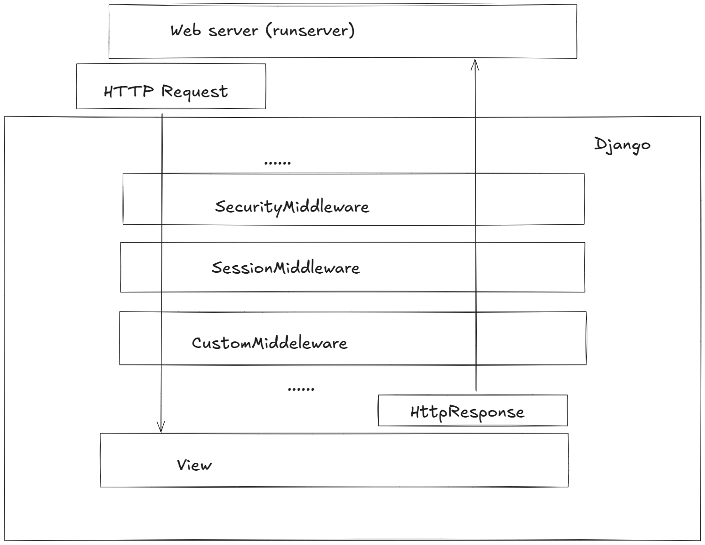

# Django - Users - 02: Authentication

> Learning Goals
>- Continue authentication: Logout & Sign up
>- LoginMixin
>- Middleware in Django
>- built-in Middleware
>- custom Middleware: examples with permissions
>- Sessions State

**Last Session

- testing crud web pages
- testing createView:
```python
.......
req =self.client.post(
    'post/',
    {'title': '...', 'body': '...', 'author': self.user.id }, 
)

self.assertEqual(Post.objects.last().body, '...')
```

- testing UpdateView:

```python
......
req =self.client.post(
    'post/1',       # test with reverse: reverse('post_edit', args=[1]) or
                    # reverse('post_edit', args='1')
                    # reverse('post_edit', kwargs={'pk': 1})
    {'title': '...', 'body': '...', 'author': self.user.id }, 
)

self.assertEqual(Post.objects.last().body, '...')
```

- Form Widgets: we were able to set css attribute in django Form widgets
What are form widgets?
- e.g. text input Fields, html Textarea
- python code defining widgets will be translated to html form input fields


```python
from django import forms
from .models import Post

class ArticleForm(forms.ModelForm):
    class Meta:
        model = Post
        fields = ['title', 'body']
        widgets = {
            'title': forms.TextInput(attrs={'class': 'my-input-class'}),
            'body': forms.Textarea(attrs={'class': 'my-textarea-class'}),
        }

```

- csrf
    - if the django csrf protection is disabled, malicious user can 
    forge a post request by deploying a form targeting our unprotected django form:

    ```html
    <form action="<url for targeted post request">
                here we fill out the key-value pairs we want to submit
    </form>
    ```

- User Authentication:

```python
# django_project/urls.py
from django.contrib import admin
from django.urls import path, include

urlpatterns = [
    path("admin/", admin.site.urls),
    path("accounts/", include("django.contrib.auth.urls")), # new
    path("", include("blog.urls")),
]
```

- within the `auth` app from `django.contrib` we have access to Views made by django:
    - e.g. LoginView
        - its url target name is also defined: `'login'`
        - we had to create the template for` django's auth loginView` on our own

### Log Out Link

We added template page logic for logged-out users, but how do we log out now?

We could go into the Admin panel and do it manually, but there’s a better way. 
Let’s add a logout link instead that redirects to the homepage.

Thanks to the Django auth system, this is dead simple to achieve.

In our base.html file,add a one-line  link for logging out just below our user greeting.

```html
<!-- templates/base.html-->
 3
<p>Hi {{ user.username }}!</p>
<p><a href="">Log out</a></p>

```

The Django auth app provides us with the necessary view so all we need to do is specify where to redirect a user upon logging out. 

Update django_project/settings.py to provide a redirect link called, appropriately, LOGOUT_REDIRECT_URL:

```python
# django_project/settings.py
LOGIN_REDIRECT_URL = "home"
LOGOUT_REDIRECT URL = "home" # new
```

If you refresh the homepage, you'll see it now has a “log out” link for logged-in users.

### Sign Up

We need to write our own view for a signup page to register new users, but Django does provide us with a form class, UserCreationForm, to make things easier.

By default, it comes with three fields: username, password1, and password2.

There are many ways to organize your code and URL structure for a robust user authentication system.

Stop the local server with Control+c and create
a dedicated new app, accounts, for our signup page.

```Shell
(.venv) $ python manage.py startapp accounts
```

Add the new app to the INSTALLED_APPS setting in our django_project/settings.py file.
```python
# django_project/settings.py
INSTALLED_APPS = [
"django.contrib.admin",
"django.contrib.auth",
"django.contrib.contenttypes",
"django.contrib.sessions",
"django.contrib.messages",
"django.contrib.staticfiles",
"blog",
"accounts", # new
]
```

Next, add a new URL path in django_project/urls.py pointing to this new app directly below where we include the built-in auth app.

```python
# django_project/urls.py
from django.contrib import admin
from django.urls import path, include
urlpatterns = [
path("admin/", admin.site.urls),
path("accounts/", include("django.contrib.auth.urls")),
path("accounts/", include("accounts.urls")), # new
path("", include("blog.urls")),
]
```
The order of our urls matters here because Django reads this file from top to bottom. 

Therefore when we request the /accounts/signup url, Django
will first look in auth, not find it, and then proceed to the accounts app.

create a file called accounts/urls.py and add the following code:

```python
# accounts/urls.py
from django.urls import path
from .views import SignUpView

urlpatterns = [
path("signup/", SignUpView.as_view(), name="signup"),
]

```

We're using a view called SignUpView, which we already know is class-based since it is capitalized and has the as_view() suffix. 

Its path is just signup/, so the complete URL path will be accounts/signup/.

Now for the view, which uses the built-in UserCreationForm and generic CreateView. 

Replace the default accounts/views.py code with the
following:

```python
# accounts/views.py
from django.contrib.auth.forms import UserCreationForm
from django.urls import reverse_lazy
from django.views.generic import CreateView

class SignUpView(CreateView):

    form_class = UserCreationForm
    success_url = reverse_lazy("login")
    template_name = "signup.html"
```

- We’re subclassing the generic class-based view CreateView 
- specify UserCreationForm
- specify the template signup.html.


Why use reverse_lazy here instead of reverse?

The reason is that the URLs are not loaded when the file is imported for generic class-based views,
so we have to use the lazy form of reverse to load them later when they're available.

create the file signup.html within the templates/ directory:

``html
<!-- templates/registration/signup.html -->


<h2>Sign Up</h2>
<form method="post">

{{ form.as_p }}

<button type="submit">Sign Up</button>
</form>

```

This format is very similar to what we’ve done before. 

We extend our base template at the top, place our logic between <form></form> tags, use the
csrf_token for security, display the form’s content in paragraph tags with form. as_p, and include a submit button.

Notice how there is a lot of extra text that Django includes by default.

I've created a new user called "john_snow" and, upon submission, was redirected to the login page.

Then after logging in successfully with my new username
and password, I was redirected to the homepage with our personalized “Hi username” greeting.

Our ultimate flow is, therefore: Signup -> Login -> Homepage. 

And, of course, we can tweak this however we want. The SignUpView redirects to login because we set 
success_url = reverse_lazy('login').


### Sign Up Link

One last improvement we can make is to add a signup link to the logged-out homepage. We can’t expect our users to know the correct URL after all! 

How do we do this? 

Well, we need to figure out the URL name, and then we can pop it into our template. 

In accounts/urls.py, we provided it the name of signup, so that’s all we need to add to our base.html template with the url template tag just as we’ve done for our other links.

Add the link for “Sign Up” just below the existing link for “Log In” as follows:

```html
<!-- templates/base.html-->
<p>You are not logged in.</p>
<a href="">Log In</a> 
<a href="">Sign Up</a>
```

If you refresh the logged-out homepage, the signup link is now visible.


### Protecting your Views
In Django, a `LoginRequiredMixin` is often used to ensure that a user must be logged in to access certain views. It redirects the user to the login page if they are not authenticated.


### Example: Using `LoginRequiredMixin` in a View

Let's protect our BlogDetailView.
You can add the `LoginRequiredMixin` to the view.

#### 1. Using `LoginRequiredMixin` with `DetailView`

```python
from django.contrib.auth.mixins import LoginRequiredMixin
from django.views.generic import DetailView
from .models import Post

class BlogDetailView(LoginRequiredMixin, DetailView):
    model = Post
    template_name = 'post_detail.html'
    #login_url = reverse_lazy('home') # optional

```


- **LoginRequiredMixin**: Ensures that the user is logged in. If not, they are redirected to the `login_url` specified (default is `/accounts/login/`, **really, they hardcoded that!?**).
- **login_url**: You can customize where users should be redirected if they are not logged in.


### Middleware

Middleware is a framework hooks into Django’s request/response processing.
It’s a light, low-level “plugin” system for globally altering Django’s input or output.

Each middleware component is responsible for doing some specific function.
For example, Django includes a middleware component, AuthenticationMiddleware, that associates users with requests using sessions.



### Built-in middleware

- middleware components that come with Django
- see settings.py:

```python
#django_project/settings.py
MIDDLEWARE = [
    'django.middleware.security.SecurityMiddleware',
    'django.contrib.sessions.middleware.SessionMiddleware',
    'django.middleware.common.CommonMiddleware',
    'django.middleware.csrf.CsrfViewMiddleware',
    'django.contrib.auth.middleware.AuthenticationMiddleware',
    'django.contrib.messages.middleware.MessageMiddleware',
    'django.middleware.clickjacking.XFrameOptionsMiddleware',
]
```

### Writing your own middleware

A middleware is a callable that takes a request and returns a response, just like a view.

A middleware can be written as a function that looks like this:

```python
def simple_middleware(get_response):
    pass # here we do one time configuration

    def middleware(request):
        pass
        # code to be executed for each request/response cycle
        response = get_response(request)

        return response

    return middleware

```

Or it can be written as a class whose instances are callable, like this:

```python
class SimpleMiddleware:
    def __init__(self, get_response):
        self.get_response = get_response

    def __call__(self, request):
        # Code to be executed for each request before
        # the view (and later middleware) are called.
        if request.COOKIES.get('toke'):
            request.META['logedin'] = True

        response = self.get_response(request)

        response.set_cookie({'key': 'value'})

        return response

```

The **get_response** callable provided by Django might be the actual view (if this is the last listed middleware) or it might be the next middleware in the chain. 

The current middleware doesn’t need to know or care what exactly it is, just that it represents whatever comes next.

Middleware can live anywhere on your Python path.


### __ init__(get_response)

Middleware factories must accept a get_response argument.

You can also initialize some global state for the middleware.

### Activating middleware
To activate a middleware component, add it to the MIDDLEWARE list in your Django settings.py.

```python
MIDDLEWARE = [
    "django.middleware.security.SecurityMiddleware",
    "django.contrib.sessions.middleware.SessionMiddleware",
    "django.middleware.common.CommonMiddleware",
    "django.middleware.csrf.CsrfViewMiddleware",
    "django.contrib.auth.middleware.AuthenticationMiddleware",
    "django.contrib.messages.middleware.MessageMiddleware",
    "django.middleware.clickjacking.XFrameOptionsMiddleware",
    ...
]
```

The order in MIDDLEWARE matters because a middleware can depend on other middleware. For instance, AuthenticationMiddleware stores the authenticated user in the session; therefore, it must run after SessionMiddleware. 

### Example 1. Middleware Code Example (`blog/middleware.py`)

First, place the middleware in the `blog` app, inside `blog/middleware.py`:

```python
from django.contrib.auth.models import User
from django.http import HttpResponse

class SpecialUserMiddleware:
    def __init__(self, get_response):
        self.get_response = get_response
        # One-time configuration and initialization.

    def __call__(self, request):
        # Code to be executed for each request before
        # the view (and later middleware) are called.

        user_id = request.session.get('_auth_user_id')
        if user_id:
            user = User.objects.get(pk=user_id)
            return HttpResponse(f"You are user {user}!")

        response = self.get_response(request) #here we pass request to further middlewares & Views
     
        print(response)
        response.write('Hello world')
        return response
```

### Register the Middleware in `settings.py`

Now, you need to add your middleware to the `MIDDLEWARE` list in `settings.py`, specifying the path as `blog.middleware.SpecialUserMiddleware`.


```python
# settings.py

MIDDLEWARE = [
    'django.middleware.security.SecurityMiddleware',
    'django.contrib.sessions.middleware.SessionMiddleware',
    'django.middleware.common.CommonMiddleware',
    'django.middleware.csrf.CsrfViewMiddleware',
    'django.contrib.auth.middleware.AuthenticationMiddleware',
    'django.contrib.messages.middleware.MessageMiddleware',
    'django.middleware.clickjacking.XFrameOptionsMiddleware',
    
    # Register your custom middleware
    'blog.middleware.SpecialUserMiddleware',
]
```


### Example2 (protected routes Middleware)

```python
from django.urls import reverse, resolve
from django.http import HttpResponseRedirect

class ProtectSpecificRoutesMiddleware:
    def __init__(self, get_response):
        self.get_response = get_response

    def __call__(self, request):

        # List of protected URL names
        protected_url_names = [
            'post_new',
            'post_edit',
            'post_delete',
        ]

        # Resolve the current path to its URL name
        try:
            current_url_name = resolve(request.path_info).url_name
        except:
            current_url_name = None

        # Check if the current URL name is in the protected list and the user is not authenticated
        if current_url_name in protected_url_names and not request.user.is_authenticated:
            # Redirect the user to the login page or any other page
            return HttpResponseRedirect(reverse('login'))

        response = self.get_response(request)
        return response
```

- We have a list of URL names that we wish to protect. Users trying to access these routes will be checked for authentication.
-  For each request, we use the resolve function to determine the URL name associated with the current path.
- If the path doesn't correspond to any URL name, we set current_url_name to None.
- If the URL isn't protected or the user is authenticated, we continue processing the request through subsequent middleware layers and eventually to the designated view.


## Web Sessions

**1. Requests are Stateless:**

In the world of web technologies, the HTTP protocol, which forms the foundation of data communication on the World Wide Web, is stateless. 

This means that each request from a client to a server is treated as an isolated transaction with no memory of previous requests. 

From the perspective of the server, every request is a new one, without any context from prior interactions.

**2. Web Sessions:**

Because HTTP is stateless, there arose a need to maintain some **sort of state** during user interactions on websites, especially for scenarios like online shopping, logging into user accounts, etc.

This is where web sessions come into play.

A web session is a mechanism used to store user-specific information on the server side during multiple request-response interactions.

Sessions can be implemented in various ways, like using cookies, hidden form fields, and server-side session management.

The purpose is to give the user a continuous experience, as if the server "remembers" them, even though HTTP by nature does not.


**3. User and State:**

The "state" refers to any data or information about that user's interaction that we want to maintain across multiple requests.

This state can include things like login status, items added to a shopping cart, **user preferences**, and more.

--> while HTTP requests are inherently stateless, web sessions provide a way to maintain state across multiple interactions, ensuring a seamless user experience.


#### Session Data with Django

Django does all the hard work of managing session ids.

The session property of the request object in views can be used to get and set the data.