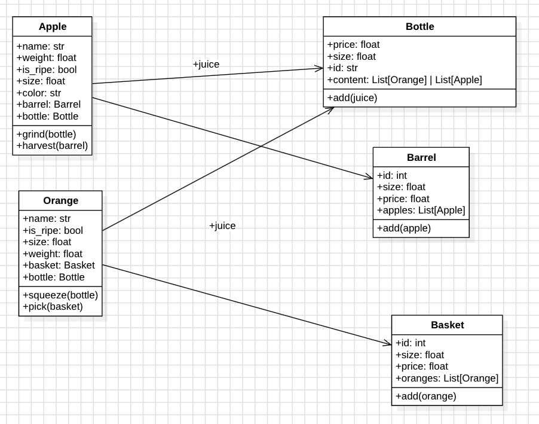

# Basic OOP 
- ClassRoom Exercise: [Python OOP Basics](https://classroom.github.com/a/Mjb32c-P)


## Thursday - 2024-09-27
- understand inheritance basics
- differentiate between superclasses (parent class) and subclass (child class)
- understanding the `super()` keyword
- learn how to override methods


## Today - 2024-10-01
- Different components of of OOP
    - OOA(Object Oriented Analysis)
    - OOD (Object Oriented Design)
    - OOP (Object Oriented Programming)
- Objects and Classes
- Attributes and methods
- Encapsulation and Abstraction
* [Exercise](https://classroom.github.com/a/Mjb32c-P)


## Object Oriented Programming


### Object
> It is a collection of data(properties) and associated behaviors(actions)

### OOP

> A programming paradigm that consist of a collection of interacting objects via their data and behavior

### OOP Process

#### OOA - Object Oriented Analysis
> This is the process of looking at a problem, system or task and identifying the objects and iteracting between those objects.

**Idea**

As an business man, I want to start a fruit processing company so that I can sell fruits and fruit juice.

**Analysis**
- What fruits are we going to deal with? `Oranges`, `Apples`
- We are going to sell fruits and fruit juice in containers. What containers?
    - Basket -> Oranges
    - Barrel -> Apples
    - Bottle -> juice
    
##### OOD - Object Oriented Design
- At the end, we should have an `Implementation Specification`
- Personally, I like to use the UML diagrams
    - To design the relationship between objects, I like to use the `Class Diagram`.



## OOP - Object Oriented Programming

> Transform the Implementation specification into code

### Classes
> A class is a blueprint for creating objects

**Examples**

- The `blueprint of a house` vs the `real house`
- The `recipe` and the `meal`
- A `pseudocode` and the `code`
- `Algorithm` and the `program`

#### Skeleton of your classes

```python
# Apple class
class Apple:
    pass 

class Orange:
    pass

class Bottle:
    pass

class Barrel:
    pass

class Basket:
    pass

apple1 = Apple()
apple2 = Apple()

print(apple1) # <__main__.Apple object at 0x1052f05d0>

print(apple2) # <__main__.Apple object at 0x1059f9c50>

apple1 is apple2 # False
```

## Attributes

- `Class Attributes`:  Attributes that belong to a class. If changed in the class, it affects all objects of that class
- `Instance Attribute`: Attributes that belong to an object. if changed in the object, it won't affect other objects.

### Constructor
> Initializes the attributes of the object.

- It uses a special method, also known as dunder method `__init__`.

### Encapsulation and Abstraction

- The main purpose of having classes, is to achieve encapsulation. ie, encapsulating or creating a wrapper around data and functions. We could also use the term `information hiding`. 
- In the cause of hiding, we need a way to expose a public interface where other objects can iteract with our object. This is where abstraction comes in. Where we expose only the interfaces that are neccessary for the task. 
- Interface can be attributes and or methods that can be used by other objects.

> Abstraction is the process of encapsulating information with a separate public interface.

**Example**

```
When you purchase a TV, you are provided a remote control which act as an interface to the TV. You can use it to tune to different channels, adjust the sound and so on. However, you may not be interested in the mechanism behind these operations like how is the TV getting signals from the remote control or how does it transfer sound to the speakers.

However, if you are a technician, you may be interested in these details. So, you see that on the same object, we may have different interfaces base on the object interacting with that object.
```