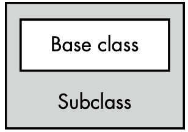

# Basic OOP 

## Tuesday - 2024-10-01
- Different components of of OOP
    - OOA(Object Oriented Analysis)
    - OOD (Object Oriented Design)
    - OOP (Object Oriented Programming)
- Objects and Classes
- Attributes and methods
- Encapsulation and Abstraction
* [Exercise](https://classroom.github.com/a/Mjb32c-P)

## Today - 2024-10-02
- Inheritance
- Method Overriding
- Visibility (Access Modifiers)
- [Exercise](https://classroom.github.com/a/wBtJJAw4)

### Inheritance
- Inheritance is an important concept of OOP

> Inheritance creats an `IS A/AN` relationship between two or more classes.

- A Student `is a` person
- A Car `is a` vehicle
- A Dog `is an` animal
- An apple `is a` fruit

#### Common properties
`Dog`, `Cat`, `Lion` are all Animal because they all have some common properties

Some of the common properties are
- Reproduction
- Respiration
- Excretion
- Growth
- Movement

### Naming convention for inheritance
- `Superclass` vs `subclass`
- `Parent class` vs `Child class`
- `Base class` vs `Derived class`

#### Base Class

> It is a class that is inherited from; it serves as a starting point for the derived classes.

#### Derived Class

> It is a class that is doing the inheriting; It enhances and expand the base class



The base class is absorbed in the derived class

### Why Inheriting?
- The derived class want to `redefine` or `override methods` of the base class
- The derived class want to `add more methods` to the base class

## Example
- Analysis, Design, Implementation

### Object Oriented Analysis

**Idea**: Build a switch application

**Requirement
- Employee
    - Manager
    - Software Engineer
    
### Object Orient Design

- Employee
    - **Attributes**
        - salary
        - first_name
        - last_name
        - hired_date
        - rate_per_hour
    - **Behaviors**
        - get_names()
        - get_pay_per_year() # annual pay based on the hourly rate
        
- Manager
    - **Attributes**
        - reports
        - travel_perk
    - **Behaviors**
        - get_reports()
        - request_report()
        - travel()
        
- Software Engineer
    - **Attributes**
        - seniority_level
        - work_status
    - **Behaviors**
        - push_code()
        - write_code()
        - review_code()

## Implementation
Check code in `employee.py`

## Type of Inheritance

- Single Inheritance
- Multiple Inheritance
- Multilevel Inheritance
- Hybrid Inheritance
- Hierarchical inheritance


### Single Inheritance
- Hermaphrodite: `Snail`


### Multiple Inheritance
`Son(Mother, Father)`


### Miltilevel Inheritance
`Son( Father(Grandfather))`


#### Hierarchical inheritance
`Son(Father), Daughter(Father)`


#### Hybrid Inheritance

`Son(Father), grandson(Son(Father))`

`Son(Father(grandfather), Mother(grandmother))`

**Best Example**: Organizational hierarchy structure


## MRO -> Method Resolution Order

> MRO is the order in which a method is searched for in an inheritance

How do you check it: `ClassName.__mro__`

```python
class A:
    def p(self):
        print('From A')
        
class B(A):
    def pp(self):
        print('From B')

class D:
    def p(self):
        print('From D')
        
class C(B, D):
    def p(self):
        print('From C')
        super().p() # call B


C.__mro__ # (__main__.C, __main__.B, __main__.A, __main__.D, object)

c = C()
c.p()
#From C
#From B
```

## Self-study
Visibility (Access Modifier)
- Public
- Protected
- Private

## Exercise
Modify the `Fruit processing program` covered in the previous lesson and apply the concept of inheritance and access modifier